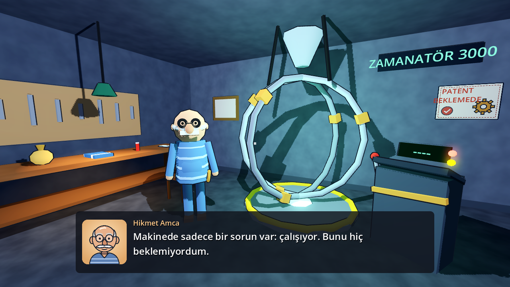
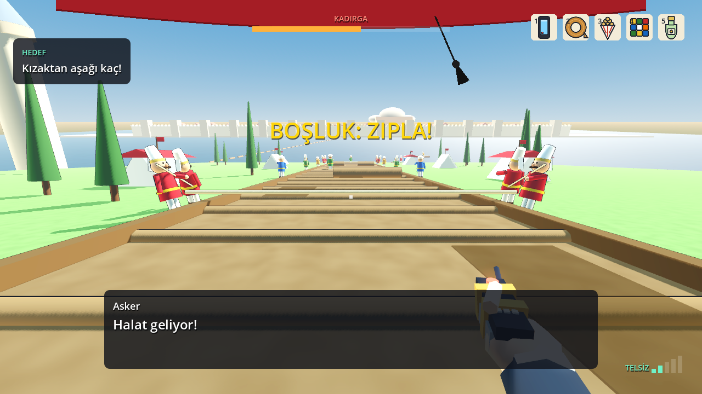
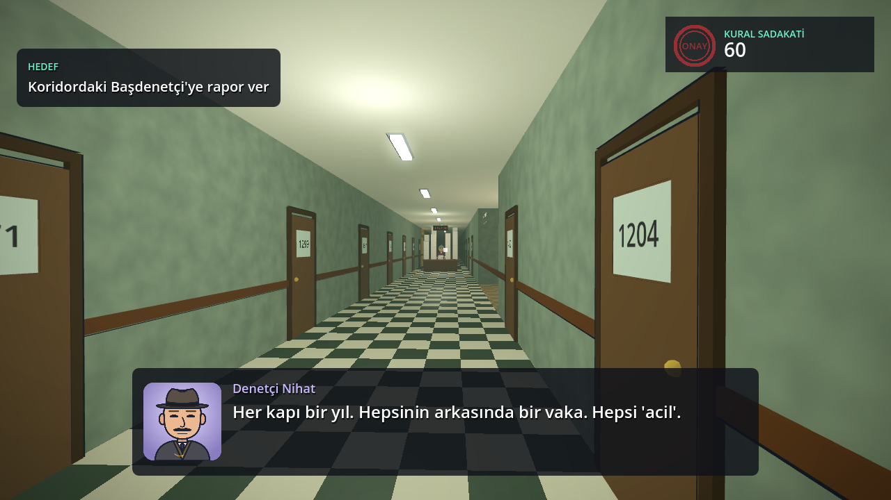
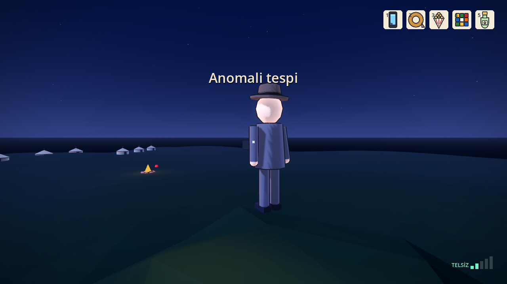

# Gerçek Tarih Bu Değil · Not a History Game

Birinci şahıs, Monty Python tarzı bir zaman yolculuğu komedisi. Emekli komşusunun koli bandıyla tutturulmuş zaman makinesine binen bir belgesel bağımlısı, **1453 İstanbul kuşatmasının** ortasına düşer ve "gelecekten gelen bilgisiyle" Fatih Sultan Mehmet'e yardım etmeye çalışır. Üstünde 400 yıl erken bir fes, elinde bir mektup, yolu ise belki Bizans'tan geçiyor.

*A first-person, Monty Python-style time travel comedy. First episode: the 1453 siege of Constantinople.*






## İndir ve oyna (Windows)

**[⬇ Son sürümü indir](https://github.com/TradersEntertainment/nothistorygame/releases/latest)**

- **Kolay yol:** `GercekTarihBuDegil-Setup-x.y.z.exe` dosyasını indir, çalıştır, *İleri → Kur*. Yönetici izni gerekmez; masaüstüne kısayol ekler, *Ayarlar → Uygulamalar*'dan kaldırılabilir.
- **Kurulumsuz:** `GercekTarihBuDegil-Windows-x.y.z.zip` dosyasını aç, `GercekTarihBuDegil.exe`'ye çift tıkla.
- Windows *"kişisel bilgisayarınızı korudu"* uyarısı verirse: **Ek bilgi → Yine de çalıştır**. Oyun imzasız olduğu için bu uyarı normaldir.

Yeni sürüm yayınlamak için repodaki `VERSION` dosyasındaki sürümü değiştirip `main`'e gönder (örn. `0.2.0`). Alternatifler: GitHub'da **Actions → Release → Run workflow** (`version` alanına sürümü yaz) ya da `v` ile başlayan bir etiket gönder (`git tag v0.2.0 && git push origin v0.2.0`). GitHub Actions oyunu test eder, Windows ve Linux için derler, kurulum programını üretir ve Releases sayfasına yükler (`.github/workflows/release.yml`). Daha önce paylaşılmış bir sürüm bağlantısı varsa etiketini `.github/release-mirrors.txt` dosyasına ekle: o sayfa da her yeni sürümde en yeni dosyalarla güncellenir. Paylaşmak için en iyisi her zaman `releases/latest` bağlantısı.

## Kaynak koddan oynamak (Godot)

**Durum:** Bölüm 1–16 oynanabilir: Bölüm 10'un yedi dalının hepsi (Ziyafet, Büyük Atış, Galata, Heyet, Arşiv, Lağım, Otağ Kapısı), Bizans'ı Kurtar yolu (Son Akşam), gizli Bölüm 16 ve final. Ana hat baştan sona, Pazartesi sabahına kadar açık; 13 isimli final var.
- **Bölüm 1 — Zamanatör:** açılış, kostüm, çanta (10 eşyadan 5), Telsiz-Kumanda, 1453 → 14:53 paneli, süreli karar, 3 sonuç.
- **Bölüm 2 — Yağlı Kızaklar:** 22 Nisan 1453'e düşüş, telsiz kararı, kadırga kovalarken kızak kaçışı (şerit değiştir, zıpla), Haliç'te kıyı ya da zincir, kayığın altına dalma, 5 sonuç ve "bütçe yetmedi" haritası.
- **Bölüm 3 — Vaka 1453-T:** Denetçi Nihat olarak zamanın dışındaki Zaman Bürosu (Form Z-1, sonsuz koridor, kostüm deposu), 2026'da Hikmet'in garajında Paradoks İzi (tekmenin hologramı) ve Hikmet'in sorgusu: yaklaşım, yalanı yakala ya da geç, makineye el koy / mühürle / bırak. 5 sonuç; Kural Sadakati, Hikmet ↔ Nihat ilişkisi ve Büro Baskısı göstergeleri.
- **Bölüm 4 — İlk Gece:** Bölüm 2'nin sonucuna göre iki yol. **4a · Ordugâh:** esir çadırından (ya da pazar tezgâhının altından) Hasan ile Hüseyin'in "kim kim" tartışmasını kollayıp sandıktan sandığa geç ya da yakalanınca eşya göster (termos, küp, koli bandı); iki kez yakalanırsan bulaşığa. **4b · Deniz surları:** zincirde denge, surdan Niko'nun fırlattığı tavuk, incir çuvalı ve kalkanlardan kaç, dördüncü tavuk Sinerji olur; kapıda fes kararı. 6 sonuç. Bölüm, Perde I kapanışıyla biter: tepede Nihat, daktiloda "Anomali tespit edildi."
- **Bölüm 5 — Garajda Gece (Perde II):** Hikmet'i ilk kez oynarsın, 2026, gece 04:00. Kapıda Zaman Bürosu'nun gri minibüsü; projektörü garajın içinde gezinir. Bölüm 3'e göre makineyi söküp bodruma saklarsın, mührü koli bandıyla aşarsın ya da el konulduysa yedek Telsiz-Kumanda'yı ararsın. Sonra ⏱ telsiz frekansı, bölümün tek ciddi anı (1977) ve kartvizit varsa Nihat'ı arama. 4 sonuç.
- **Bölüm 6 — Ordugâh / Surların İçi:** Bölüm 4'e göre iki yol. **6a · Ordugâh (gündüz):** otağa ulaşmanın dört yolu: Kadri'ye leblebi (yamak, fes çıkar), Lütfi'yi etkile (Frenk elçisi, fes tak), Urban'ın çatlak topu (çırak) ya da pazarda üç iyilik (keçi, yüzük, asker mektubu → kaftan). Kukuletalı "kimse" gizli bir mektup verir. **6b · Surların İçi:** Bizans Labirenti: 7 oda, 7 mühür, sırayı kimse bilmez (4 hatada zindan; 💼 akış şeması sırayı çözer), sonra Giustiniani (⏱ uyar ya da sus) ve İmparator'un mektubu: açmak mı? 5 + 6 sonuç, Paradoks göstergesi.
- **Bölüm 7 — Saha Çalışması:** Denetçi Nihat, Büro'nun tarlada tek başına duran saha kapısından 1453'e iner. Elinde pirinç Paradoks Tarayıcı: ize yaklaştıkça ekranı kırmızıya döner. Tolga'nın izlerini tarar (sıcak izde hologram), tanıklarla konuşur (Kadri, Lütfi, Urban, Hasan ile Hüseyin; Bizans'ta Niko, Theodoros, Giustiniani, İmparator) ve 17:00'de güneş batmadan daktiloya konumu yazar. Her konuşma ve tarama saat harcar. ⏱ Nöbetçilerle çay molası, tarihi bir kişiye Form Z-1453 doldurtmak, Theodoros'la meslek sohbeti, Tolga'yı seven tanıkların yalanları ve Sadakat 35'in altındaysa ⏱ Yönetmelik Duvarı (formu yırt). 5 + 4 sonuç.
- **Bölüm 8 — Hırdavatçı:** Hikmet, pazartesi 05:00'te pijamayla Nöbetçi Hırdavat'a gider; Büro minibüsü peşindedir. İçeride iki ajan el fenerleriyle reyonları gezer: ışıklarına yakalanmadan kondansatörü (1453 µF), anteni ve (Tolga koli bandını götürdüyse) ajanların mühür çantasındaki son bandı topla. ⏱ Servis 07:30'da; her yakalanma 10 dakika, üçüncüsünde sepete el konur. Makineye el konulduysa liste depo soygunu malzemesine döner (sahte Büro kartı). Kartvizit varsa Nihat'ı ara; Nihat Kuralsızsa ajanları geri çağırır. Garajda ⏱ büyük karar: makineye kendin bin (pijamayla 1453'e) ya da kal. 4 sonuç.
- **Bölüm 9 — Teklifler:** 25 Nisan sabahı ordugâhta yol değiştiren teklifler: Kadri'nin ziyafeti (menü denemesi), Lütfi'nin Bizans'a heyeti (Frenkçe selam denemesi), Urban'ın büyük topu (%1 şarjlı açı hesabı), Çandarlı Halil Paşa'nın Galata mektubu (Y yolunda garanti; mektubu Fatih'e götürmek Merak +1) ve labirenti kusursuz geçenlere, eksik çıkış formu için savaş hattını geçen Theodoros'un arşiv teklifi. Hepsini reddedip otağ kapısında beklemek de bir yol. Hikmet makineye bindiyse pazarda pijamayla bir keçiden kaçarken karşına çıkar. 6 sonuç.
- **Bölüm 10 — Otağ Kapısı** (bütün teklifler reddedildiyse): Sorucu Ağa, köprü bekçisi gibi üç soru sorar (⏱ süreli): adın, geliş sebebin ve saçma bir soru (devenin suyu, otağın direkleri, kavuğun boyu). Cevaplar kuyruktaki deveci, derviş ve Venedikli terzide. Yalan söylersen Hasan ile Hüseyin seni hafifçe dışarı taşır; soruyu soruyla cevaplarsan Ağa'nın kafası karışır; dürüst bir "bilmiyorum" Merak kazandırır. 🥜 ve 🤳 soruları kısaltır. Bizans'tan mektupla gelenler elçi töreniyle girer. Kapının ardında, perdenin önünde bir gölge: "Yarın." 2 sonuç. Diğer beş dal (Ziyafet, Büyük Atış, Galata, Heyet, Arşiv) yakında.
- **Bölüm 10 — Büyük Atış** (9.2, Urban'ın teklifi): Bronzu üç kalıba dök (güç çubuğu), topa ad koy (Pazartesi / Koli / Sigorta / Küp), Fatih sahaya gelir. Çatlağı bantla ya da bantlama, barutu seç (normal, iki katı, iki katı + powerbank), ⏱ açıyı hesap makinesiyle (%1), göz kararı ya da Rubik küpüyle bul, fitili yak. Gülle Galata'daki bir şarap fıçısına düşer (W5), yirmi metre öteye düşer ya da risk yüksekse **Büyük Patlama**: ağır çekimde herkes uçar, Hasan ile Hüseyin Kadri'nin kazanına, keçi çadırın tepesine, Tolga Fatih'in önüne düşer (W5B). 3 sonuç; dal kapanır, 11'den sonra 13'e geçilir.
- **Bölüm 10 — Ziyafet** (9.1, Kadri'nin teklifi): Sultan'ın ziyafetini sen pişiriyorsun. Menüde Tolga'nın modern önerileri tarihe takılır ("Domates ne?", "Patates ne?": ikisi de Amerika'dan gelir). Üç kazan, ateş çubuğu, Kadri'nin fikir değiştiren tadımları, 🥜 gizli malzeme. İki kazan yanarsa mutfak patlar ve leblebi yağar (10Z.2). Yoksa Fatih mutfağa gelir: *"Bunu kim pişirdi?"* İkisi aynı anda: *"Ben."* (10Z.1, W7 Sultan'ın Sofrası).
- **Bölüm 10 — Galata** (9.3, Çandarlı'nın mektubu): Haliç'in öbür yakası, Ceneviz'in tarafsız mahallesi. Herkes seni başka birine yollar: balıkçı ("Hangi Lomellino?"), şarapçı ("Önce şarap"), noter ("Bu mühür Venedik için"), iki tarafa da barut satan toptancı. ⏱ Gemi çanı: iskeleye yetiş. Gemiye bin (10G.1, Venedik'e Elçi, W6; gemi Haliç'ten çıkarken burunda Fatih başını hafifçe eğer) ya da mektubu Fatih'e götür (10G.2).
- **Bölüm 10 — Arşiv** (9.5, Theodoros'un teklifi): Bizans arşivini plaza yöntemiyle düzenle (renk kodu: kırmızı acil, mavi rutin, yeşil "bir gün bakarız"). Nihat gelir ve duvarda Form Z-1'in aslını görür: Zaman Bürosu'nun kuruluş belgesi, imza yeri boş: "T." Otağda Fatih formu üç dakikada imzalar: *"Bürokrasinin en iyisi, kısa olanıdır."* ⏱ İmzala (10A.1, Büronun Kuruluşu, W8; ilk Büro toplantısı) ya da *"Ben sigortacıyım"* (10A.2).
- **Bölüm 10 — Lağım** (9.7, Lağımcı Dragan'ın teklifi; her ordugâh yolunda açık): Novo Brdo'lu madencilerle surların altına lağım. Mum ışığında kaz, tavanı destekle, kulağını toprağa daya; üç kez desteksiz kazarsan tavan çöker ve Nihat seni bir formla kazıp çıkarır. Altı kazmada karşı lağıma, Bizanslı mühendis Grant'ın odasına açılırsın: *"Siz de mi kazıyorsunuz?"* Poliçe ya da leblebiyle **Tünel Sulhu** (W13: Marmaray kazısında iki tünel ve ortada bir piknik alanı).
- **Bölüm 10 — Heyet** (9.4, Lütfi'nin teklifi): Osmanlı heyetiyle beyaz bayrak altında surların içine gir. Lütfi her şeyi yanlış tercüme eder ("Sultan şehrinizde deniz manzaralı bir ev arıyor"), Theodoros sana doğrusunu fısıldar: ⏱ düzelt ya da karışma. İmparator'un mühürlü mektubu (aç ya da açma). Çıkışta ⏱ *"Majeste... gelecekten geliyorum."* → **Bizans'ı Kurtar**: gece topların surda açtığı gediği koli bandıyla kapat, Giustiniani'nin omzuna powerbank'ten ısıtıcı, zincir nöbetçilerine leblebi. Her biri Direniş +1.
- **Bölüm 12 — Son Akşam** (Direniş ≥ 1): Konstantinos'la surlarda gün batımı; ordugâhın ateşleri yanmaya başlar. ⏱ *"Yaptığın şey yetecek mi?"* Tarih inatçıdır: fetih engellenemez, sadece ertelenir. Pazartesi gazetesi: **1454** (W10), **Uzun Bekleyiş / 1455** (W11), **Evrak Eksik / 1456** (W12).
- **Bölüm 11 — Yüzleşme:** Gece. Önce Nihat olarak saha kapısından iner, tarayıcıyla Tolga'yı ateşin başında bulursun: "Form Z-1453'ü doldurmadınız." ⏱ Tutukla / Rapor et ama bırak / Yardım et (Sadakat düşükse Yönetmelik Duvarı). Sonra kontrol Tolga'ya geçer: üç turda İkna olasılığı %'yi yükselt (🥜 +15, dürüstlük, risk analizi), kaç ya da teslim ol. Pijamalı Hikmet (8.4) formlarla kavgaya girer, dost Niko Sinerji'yi fırlatır. İz kaybolduysa ve Büro Baskısı kritikse Nihat görevden alınır. 6 sonuç.
- **Bölüm 12 — Huzur:** Otağın içinde, Fatih'in karşısında. İkna olasılığı % Merak'la yükselir: dürüst bir "hiçbir şey bilmiyorum", ilginç eşyalar (Fatih küpü kırk saniyede çözer), Urban'ın topuna doğru bir mühendislik yorumu, İmparator'un mektubu (açtıysan itiraf). Yanındakiler sahneyi değiştirir: Hikmet makineyi anlatır, Fatih Nihat'ın formunda yazım hatası bulur. ⏱ Kilit soru: "Bu şehir alınacak mı?" 6 son: Tarih Yerinde, Leblebipolis, İki Hükümdar, Sultan'ın Tamiri, Mühendisler Meclisi ya da mutfak (bir kez yeniden denenir).
- **Bölüm 13 — Dönüş Penceresi:** Pazartesi 07:15, servise 15 dakika. Hikmet olarak ⏱ zaman frekansını 1453'e kilitle, kolu çek; kontrol son saniyelerde Tolga'ya geçer ve pencere açıkken kırmızı düğmeyi basılı tutmalısın. Pencerenin süresi Telsiz Bağı'na bağlı (3–12 sn). Versiyonlar: garaj; el konulduysa sahte kartla Büro deposu (Nihat katıldıysa kapı açık); Hikmet 1453'teyse Urban'ın atölyesinde topun gücüyle, birlikte dön ya da Hikmet kalsın; Fatih tamir ettiyse kutlama. Frekans kaçarsa Tolga 1977'deki o düğüne düşer ve genç Hikmet'i dansa kaldırır. 5 sonuç.
- **Bölüm 16 — Gıdak** (gizli): Bölüm 13'te pencere kaçarsa ve Sinerji Tolga'nın yanındaysa (Bizans yolu) 90 saniyeliğine tavuk olursun. Kamera tavuk yüksekliğinde; Telsiz-Kumanda yerde, Hasan ile Hüseyin Tolga'yı omuzlarında taşıyor. Kırmızı düğmeyi üç kez gagala; muhafızlara yakalanma, kediden kaç, leblebiye bakma. 16.1 → 13.6 (Tolga döner, garajda bir tavuk), 16.2 → 13.2.
- **Bölüm 14 — Son Form:** Nihat olarak Vaka 1453-T'nin son raporunu daktiloda yaz. Seçenekler geçmişine göre açılır: 'Tarih düzeltildi', rapor tahrifatı (Kuralsız Nihat), Tolga'yı Büro'ya almak (Tolga tutuklandıysa ya da kapıda Büro kaydı varsa; önce Bekleme Salonu'nda sıra no 4.582.119), istifa (Hikmet'le bağın güçlüyse). Nihat görevden alındıysa yeni model Nihat masaya oturur. 5 sonuç.
- **Bölüm 15 — Pazartesi (final):** Garaj, Nihat'ın masası, servis durağı ve ofis. Durağın tabelası kurduğun dünyayı gösterir (Leblebipolis, Tavuk Sigorta, Sultan'ın Tamiri). Pazartesi toplantısında Tolga ilk kez "Bilmiyorum" diyebilir, ama sadece Sultan'a dürüst davrandıysa. Final kartında Tolga, Hikmet, Nihat ve dünya için kader özeti var. 13 isimli final: İki Komşu 1453'te, Boş Masa, Başka Bir Yıl, Gece Mesaisi, Sultan'ın Tamiri, Zaman Tamir Servisi, Yeni Model, Mühürlü Garaj, Pijamalı Kurtarma, Kuralsız, Düzeltildi Ama..., Kimse Fark Etmedi, Sıradan Bir Pazartesi.
- Her bölüm akış şemasıyla biter; Enter ile sonraki bölüme geçilir, çanta, Telsiz Bağı ve sonuçlar taşınır.
- **Ana menü** (Hikmet'in garajında): Devam Et, Yeni Oyun, **Bölümler** (ulaştığın herhangi bir bölümün başına dön, başka yol dene), **Kayıt Yükle** (3 yuva), Ayarlar (müzik, efekt, konuşma, fare, tam ekran, dil). Her bölüm başında otomatik kayıt alınır.
- **Esc** oyun içinde duraklatma menüsünü açar: bölümün başına dön, önceki bölümler, kaydet, yükle, ayarlar, ana menü.

1. **Godot 4.4**'ü indir: <https://godotengine.org/download> (standart sürüm, kurulum gerektirmez).
2. Bu repoyu bilgisayarına indir (GitHub Desktop → *Clone repository* ya da *Code → Download ZIP*).
3. Godot'u aç → **Import** → repodaki `project.godot` dosyasını seç → **Import & Edit**.
4. **F5** (ya da sağ üstteki ▶) ile oyna.

İlk açılışta Godot projeyi içe aktarırken birkaç saniye bekler; bu normal.

### Kontroller
| Tuş | Eylem |
|-----|-------|
| WASD / oklar | Yürü |
| Fare | Bak |
| Shift | Koş |
| E | Etkileşim / diyaloğu ilerlet |
| Tekerlek / 1–5 | Eldeki eşyayı değiştir (Telsiz-Kumanda + çantadaki 5 eşya) |
| Sağ tık / G | Eldekini kullan: birine bakıyorsan gösterir (120 tepkilik matris), boşlukta eşyanın kendi eylemi (çay iç, leblebi ye, selfie, çakmak...) |
| V | Kendine bak (üçüncü şahıs çekim; fes ya da kaftan değişince kendiliğinden) |
| F / sol tık (Bölüm 1) | Tekme (güç çubuğu yeşildeyken) |
| H | Fesi tak / çıkar |
| Tab | Çanta (1–5 ile eşyayı geri koy) |
| R (3 sn basılı) | Kırmızı düğme (Telsiz-Kumanda'dan sonra, iade garantisi içinde; garanti bitince sadece cızırdar ama Hikmet'e sinyal gider) |
| A / D (Bölüm 2, 4) | Kızakta şerit değiştir · zincirde denge |
| Ctrl (Bölüm 2) | Suda dal |
| Enter | Akış şemasından sonraki bölüme geç |
| 1 / 2 / 3 | Seçimler |
| Esc | Duraklat (L: dil, Q: çık) |
| L | Başlık ekranında dil değiştir (Türkçe / English) |

## Belgeler
- **Oyun yapısı (Detroit tarzı: 3 karakter, 16 bölüm, akış şemaları, 357 final kombinasyonu):** [docs/CHAPTERS.md](docs/CHAPTERS.md)
- **Tasarım belgesi:** [docs/GDD.md](docs/GDD.md)
- **Hikaye kalite kontrolü:** [docs/STORY_REVIEW.md](docs/STORY_REVIEW.md)
- **Tolga'nın 1453 dalları ve dünya sonuçları:** [docs/STORY_BRANCHES.md](docs/STORY_BRANCHES.md)
- **Eşya tepki matrisi:** [docs/ITEM_REACTIONS.md](docs/ITEM_REACTIONS.md) (260 tepki + seçim/son matrisi)

## Proje yapısı
```
project.godot            Godot 4.4, GL Compatibility (web'e de çıkabilir)
scenes/main.tscn         Bölüm 1 sahnesi
scripts/
  boot.gd                Açılış: bölüm seçimi (--chapter=N)
  chapter1.gd            Bölüm 1 akışı (diyaloglar, aşamalar, sonlar, akış şeması)
  chapter2.gd            Bölüm 2 akışı (koşu, kovalamaca, Haliç, sonlar)
  chapter3.gd            Bölüm 3 akışı (Büro, Paradoks İzi, sorgu, sonlar)
  chapter4.gd            Bölüm 4 akışı (4a ordugâh, 4b deniz surları, Perde I kapanışı)
  chapter5.gd            Bölüm 5 akışı (Hikmet: minibüs, makineyi saklama, frekans, 1977)
  chapter6.gd            Bölüm 6 akışı (6a ordugâh gündüz, 6b Bizans labirenti, Giustiniani, İmparator)
  chapter7.gd            Bölüm 7 akışı (Nihat: Paradoks Tarayıcı, izler, tanıklar, rapor, Yönetmelik Duvarı)
  chapter8.gd            Bölüm 8 akışı (Hikmet: hırdavatçı, ajanlardan gizlenme, garajda büyük karar)
  chapter9.gd            Bölüm 9 akışı (Tolga: teklifler ve dal seçimi)
  chapter10.gd           Bölüm 10 dalları (şimdilik Otağ Kapısı: Sorucu Ağa'nın üç sorusu)
  chapter11.gd           Bölüm 11 akışı (gece yüzleşme: Nihat → Tolga, İkna olasılığı, Yönetmelik Duvarı)
  chapter12.gd           Bölüm 12 akışı (Fatih'in huzuru, Merak, kilit soru, 6 son)
  chapter13.gd           Bölüm 13 akışı (dönüş penceresi: frekans, kol, kırmızı düğme; garaj/depo/1453/W4)
  chapter14.gd           Bölüm 14 akışı (Nihat'ın son raporu, bekleme salonu, yeni model)
  chapter15.gd           Bölüm 15 finali (Pazartesi; isimli final çözümü, kader özeti)
  autoload/game_state.gd Bayraklar, göstergeler, meta kayıt, tuş haritası
  level/garage.gd        Garaj (bütün geometri kodla kurulur)
  level/slipway.gd       1453: kızaklar, kadırga, Haliç, surlar, Ayasofya, zincir
  level/bureau.gd        Zaman Bürosu: Nihat'ın odası, sonsuz koridor, kostüm deposu
  level/camp.gd          Gece ordugâhı: esir alanı, nöbet noktası, çadırlar
  level/sea_walls.gd     Gece deniz surları: zincir, rıhtım, sur, kapı
  level/camp_day.gd      Gündüz ordugâhı: mutfak, tercüman, top, pazar, otağ
  level/byz_city.gd      Konstantinopolis: sokaklar, kançılarya (7 oda), kara surları, saray
  level/hardware_store.gd Nöbetçi Hırdavat: sokak, minibüs, üç reyon, Cemil'in tezgâhı
  level/otag_hall.gd     Padişah'ın otağının içi: taht, halılar, fenerler, muhafızlar
  level/night.gd         Gece gökyüzü, kamp ateşi, meşale, çadır
  level/lowpoly.gd       Köşeli arazi ve gövde (kadırga, kayık) üreticileri
  level/items.gd         10 eşyanın modelleri
  level/props.gd         Low-poly parça yardımcıları
  level/monday.gd        Bölüm 15: servis durağı ve ofis (dünyaya göre tabelalar)
  npc/hikmet.gd          Hikmet Amca
  npc/soldier.gd         1453 askerleri (börklü, sarıklı)
  npc/person.gd          Büro memurları, Niko, hologram Tolga
  npc/chicken.gd         Tavuk Sinerji
  player/player.gd       Birinci şahıs oyuncu
  ui/                    Arayüz, akış şeması, fes püskülü, mırıltı sesi
i18n/strings.csv         Bütün metinler (keys, tr, en)
tests/run_tests.sh       Bölüm 1'i üç yoldan otomatik oynatan test
installer/               Windows kurulum programı (NSIS) ve OYNA.txt
assets/art/              Portreler, eşya ikonları, afişler (SVG)
export_presets.cfg       Windows ve Linux dışa aktarım ayarları
docs/                    Tasarım belgeleri ve ekran görüntüleri
```

**Görseller:** 3D modeller kodla üretilen low-poly şekillerdir; çizgi film gölgelendirmesi, dış hatlar ve gürültü dokularıyla stilize edilir. Portreler, eşya ikonları ve afişler `assets/art/` altında SVG olarak durur (`tools/contact_sheet.gd` hepsini tek bir önizlemede toplar).

## Testler
```bash
GODOT=/path/to/godot tests/run_tests.sh
```
Bölümleri ekransız olarak bütün yollardan oynatır ve sonuçları doğrular: Bölüm 1'in 3 sonucu, Bölüm 2'nin 5 sonucu (kıyıda yakalanma, gizlice çıkış, zincir, zincirden düşme, kırmızı düğme), Bölüm 3'ün 5 sonucu (el konuldu, mühürlendi, kartvizit, kurutma makinesi, çay), Bölüm 4'ün 7 yolu (6 sonuç, iki başlangıç), Bölüm 5'in 5 yolu (4 sonuç; makine serbest, mühürlü, el konulmuş), Bölüm 6'nın 8 yolu (6a'nın 4 yolu ve mektup, 6b'nin kusursuz, hatalı ve zindan labirenti) Bölüm 7'nin 9 yolu (bulundu, kayboldu, çay, form, duvar yırtıldı/yırtılmadı, Theodoros, Niko'nun yalanı, zindan) Bölüm 8'in 7 yolu (tamir, makineye binme, yakalanma, geç kalma, depo planı, Nihat'ı arama, Kuralsız Nihat) Bölüm 9'un 9 yolu (her teklif, hepsini reddetme, mektubu Fatih'e götürme, zindandan sınır dışı, pijamalı Hikmet) Bölüm 10'un 6 yolu (geçiş, üç kez taşınma, dürüst cevap, selfie çubuğu, elçi töreni, ikinci denemede geçiş) Bölüm 11'in 10 yolu, Bölüm 12'nin 8 yolu, Bölüm 13'ün 9 yolu, Bölüm 14'ün 5 yolu, Bölüm 15'in 13 finali ve Bölüm 1 → … → 15 geçişleri.

Ekran görüntülerini yeniden üretmek için:
```bash
godot --path . --rendering-driver opengl3 -- --shots=docs/screenshots
godot --path . --rendering-driver opengl3 -- --chapter=2 --shots=docs/screenshots
godot --path . --rendering-driver opengl3 -- --chapter=3 --shots=docs/screenshots
godot --path . --rendering-driver opengl3 -- --chapter=4 --outcome=2:2.1 --shots=docs/screenshots   # 4a
godot --path . --rendering-driver opengl3 -- --chapter=4 --outcome=2:2.3 --shots=docs/screenshots   # 4b
godot --path . --rendering-driver opengl3 -- --chapter=5 --shots=docs/screenshots
```
