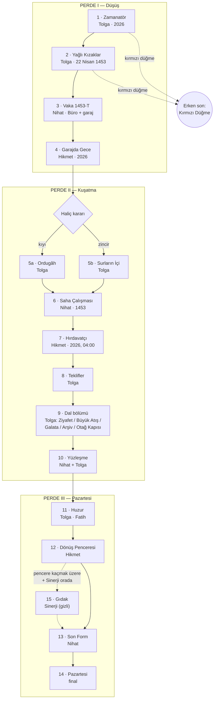
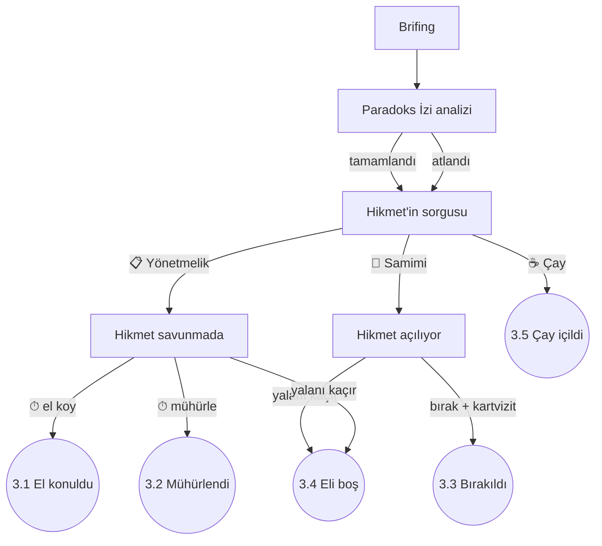
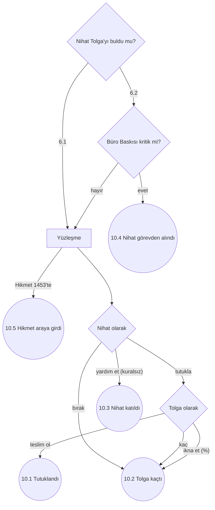

# Bölümler, Akış Şemaları ve Kaderler — v1.0
### Detroit: Become Human yapısının *Gerçek Tarih Bu Değil*'e uyarlanması

> Bu belge oyunun **ana yapısını** tanımlar. Önceki belgeler bu yapının parçalarıdır:
> - [STORY_BRANCHES.md](STORY_BRANCHES.md): Tolga'nın 1453'teki 10 sonu. Bu yapıda bunlar **Dünya sonuçları**dır (W1–W9) ve Kırmızı Düğme erken sonudur.
> - [ITEM_REACTIONS.md](ITEM_REACTIONS.md): Eşya tepkileri.
> - [GDD.md](GDD.md): Genel tasarım.

---

## 0. Özet: rakamlarla

| | Sayı |
|---|---:|
| Oynanabilir karakter | **3** (Tolga, Denetçi Nihat, Hikmet Amca) + 1 gizli (tavuk Sinerji) |
| Bölüm | **15** (14 ana + 1 gizli), 3 perde |
| Toplam oynanış (tek oyun) | ≈ 3–3,5 saat |
| Dal noktası (yönü değiştiren karar) | **41** |
| Süreli karar (⏱) | **12** |
| Bölüm sonucu (akış şemasındaki sonuç düğümleri) | **77** |
| Kalıcı durum göstergesi | **6** (Paradoks, Merak, Kural Sadakati, Hikmet ↔ Nihat, Telsiz Bağı, Büro Baskısı) |
| Karakter kaderi | Tolga **4** · Hikmet **3** · Nihat **4** · Sinerji **3** |
| Dünya sonucu | **9** + her birinin "düzeltildi" varyantı (7) = **16** |
| Final kombinasyonu (geçerli) | **357** |
| Adlandırılmış final | **15** + Kırmızı Düğme erken sonu = **16** |

**Demo:** Perde I (Bölüm 1–4), ≈ 35 dk, akış şemalarıyla birlikte. Üç karakterin üçü de demoda oynanır.

---

## 1. Detroit'ten neyi alıyoruz

| Detroit: Become Human | Gerçek Tarih Bu Değil | Açıklama |
|-----------------------|----------------------|----------|
| Üç oynanabilir karakter (Kara, Connor, Markus) | **Tolga** (1453'te tarihi değiştiren), **Denetçi Nihat** (onu arayan), **Hikmet Amca** (2026'da onu geri getirmeye çalışan) | Bölümler karakterler arasında sırayla geçer, hikayeler kesişir |
| Her bölümün sonunda akış şeması | Aynısı. Görülen yol, kilitli düğümler ve diğer oyuncuların yüzdeleri (§8) | Oyunun omurgası |
| Karakterler kalıcı olarak ölebilir, hikaye onlarsız devam eder | **Kimse ölmez.** Ama karakterler kalıcı olarak **kaybedilebilir**: Tolga 1453'te kalabilir, Hikmet'in makinesine el konulabilir, Nihat görevden alınıp yerine "yeni model" gelebilir | Ton kuralı: komedi. Kayıplar kalıcıdır, ama trajik değil absürttür |
| Connor'ın "yazılım kararsızlığı" ve kırmızı duvar | Nihat'ın **Kural Sadakati** göstergesi ve **Yönetmelik Duvarı** sahnesi: Nihat ilk kez bir formu yırtar | Nihat "kuralsız" olabilir (§3.3) |
| Connor ↔ Hank ilişkisi | **Hikmet ↔ Nihat** ilişkisi: sorgulayanla sorgulanan, zamanla tuhaf bir ikili | 5 kademe (§3.4) |
| Kamuoyu göstergesi | **Büro Baskısı**, Vikipedi tartışma sayfasının "ısısı" | Tarih bozuldukça Nihat'ın amirleri sinirlenir |
| Olay yeri yeniden yapılandırma | Nihat'ın **Paradoks İzi** analizi | Leblebi kabukları, fes izleri, koli bandı parçaları |
| Müzakere başarı yüzdesi | **İkna olasılığı %**: Hikmet sorgusu, Fatih huzuru, Nihat–Tolga yüzleşmesi | Ekranın köşesinde canlı değişir |
| Süreli kararlar ve QTE'ler | 12 süreli karar (⏱) ve 4 QTE bölümü | Tolga panikledikçe süre kısalır |
| Ana menüdeki Chloe | Ana menüde **Hikmet Amca**. Oyuncunun kararlarına yorum yapar, finalde bir istekte bulunur (§9) | Oyunun dördüncü duvarı |
| Bölümü yeniden oynama | Akış şemasından herhangi bir kontrol noktasına dönüş | Sonraki bölümler yeniden hesaplanır, uyarıyla |
| Dergiler (koleksiyon) | Vikipedi sayfa varyantları ve selfie albümü | Tarih değiştikçe yeni sayfalar açılır |

### Değişmez kuralın yeni hâli
Önceki kural: *"Tolga'nın hayatı hiçbir sonda değişmez."* Detroit yapısında karakterler kaybedilebildiği için kural şöyle güncellendi:
- **Tolga dönerse** hayatı hiç değişmez ve değişen dünyayı fark etmez.
- **Tolga dönemezse** ofiste yokluğunu kimse fark etmez. (Espri aynı kalır, sadece tersinden çalışır.)
- **Değişiklikleri fark eden tek kişi Hikmet Amca'dır.** Kimse ona inanmaz.

---

## 2. Karakterler

### 2.1 Tolga — "tarihi değiştiren" (Markus'un karşılığı)
Bölümleri: 1, 2, 5, 8, 9, 11. Kararları dünyayı değiştirir (Paradoks, Dünya sonucu).

### 2.2 Denetçi Nihat Zamanoğlu — "peşine düşen" (Connor'ın karşılığı)
- Zaman Bürosu'nun en kıdemli (ve en sabırlı) denetçisi. Vaka: **"1453-T, fesli anomali"**.
- 1453'e o da yanlış kıyafetle gider: 1920'lerden kalma fötr şapka, yelek ve bir daktilo. Büronun kostüm deposu da Tolga'nın kostümcüsü kadar dikkatsizdir.
- **Bölümleri:** 3, 6, 10, 13.
- **Göstergeleri:** Kural Sadakati, Hikmet ↔ Nihat, Büro Baskısı.
- **Görevi:** Tolga'yı bulup "tarihi düzeltmek". Ama her bölümde Tolga'yı biraz daha anlar.

### 2.3 Hikmet Amca — "geride kalan" (Kara'nın karşılığı)
- Zamanatör'ün mucidi. 2026'da, garajında, makinesini Büro'dan korumaya ve Tolga'yı geri getirmeye çalışır.
- **Bölümleri:** 4, 7, 12.
- **Göstergesi:** Telsiz Bağı.
- **Özelliği:** Tolga'nın 1453'te yaptığı her değişikliği fark eden tek kişidir. Bölümlerinde dünya (tabelalar, logolar, menüler) Tolga'nın kararlarına göre değişmiş olarak görünür.

### 2.4 Sinerji — gizli karakter
Niko'nun tavuğu. Gizli Bölüm 15'te 90 saniyeliğine oynanır (§5).

---

## 3. Kalıcı göstergeler

Göstergeler bölümler arasında taşınır ve akış şemasının altında gösterilir.

### 3.1 Paradoks (dünya) — mevcut
GDD §7.8. 0–100. Dünya sonucunu ve Denetçi'nin baskısını belirler.

### 3.2 Merak (Fatih) — mevcut
GDD §9.6. 0–3+. Bölüm 11'de **İkna olasılığı %** olarak canlı gösterilir: her Merak Puanı yaklaşık %25 ekler.

### 3.3 Kural Sadakati (Nihat) — yeni
- **100'den başlar.** Nihat'ın empatik, esnek ya da kural dışı her kararı düşürür.
- **Görünümü:** Ekranın köşesinde bir damga ikonu. Sadakat düştükçe damga soluklaşır ve çatlar.
- **Eşikler:**
  - **70+ Kurala Sadık:** Nihat her şeyi forma döker.
  - **30–69 Tereddüt:** Nihat'ın diyaloglarında "ama" kelimesi çoğalır.
  - **< 30 Yönetmelik Duvarı:** Bölüm 6 ya da 10'da özel bir sahne tetiklenir. Nihat'ın önünde dev bir yönetmelik metni belirir (Connor'ın kırmızı duvarının karşılığı). Oyuncu bir formu yırtmak için tuşa art arda basar. Yırtarsa Nihat **Kuralsız** olur, yırtmazsa sadakat 50'ye döner ve bir daha bu sahne gelmez.

| Karar örneği | Etki |
|--------------|-----:|
| Hikmet'le sorguda çay içmek | −15 |
| Makineye el koymamak | −10 |
| 1453'te Hasan ile Hüseyin'in molasına katılmak | −10 |
| Theodoros'la meslek sohbeti | −10 |
| Tolga'nın kaçmasına göz yummak | −20 |
| Bir tarihi kişiye form doldurtmak | +10 |
| Tolga'yı tutuklamak | +20 |

### 3.4 Hikmet ↔ Nihat ilişkisi — yeni
Beş kademe: **Düşman · Soğuk · Nötr · Dost · Ortak**. Bölüm 3'teki sorguda başlar, Bölüm 7, 12 ve 13'te belirleyici olur.
- **Ortak** olan ikili, Bölüm 12'de pencereyi birlikte açar (başarı şansı en yüksek).
- **Düşman** kademesinde Nihat, Bölüm 12'de Hikmet'i engellemeye çalışır.

### 3.5 Telsiz Bağı (Tolga ↔ Hikmet) — yeni
- 0–5. Tolga'nın Hikmet'in telsiz çağrılarına cevap verip vermediğine ve Hikmet'in Bölüm 4 ve 7'deki kararlarına göre değişir.
- **Etkisi:** Bölüm 12'deki dönüş penceresinin süresi. Bağ 5 ise pencere 12 saniye açık kalır, 0 ise 3 saniye.
- **Görünümü:** Tolga'nın bölümlerinde, ekranın köşesindeki telsizin sinyal çubukları.

### 3.6 Büro Baskısı — yeni (kamuoyunun karşılığı)
- Vikipedi tartışma sayfasının "ısısı". Paradoks yükseldikçe ve Nihat başarısız oldukça artar.
- **Eşikler:** Düşük / Orta / Yüksek / **Kritik**. Kritik olursa Bölüm 10'dan sonra Nihat görevden alınır ve yerine **yeni model Nihat** gelir (§4, N3).

---

## 4. Kaderler

### Tolga
| Kod | Kader | Nasıl |
|-----|-------|-------|
| **T1** | **Döndü** | Bölüm 12'de pencere açıldı ya da Fatih makineyi tamir etti |
| **T2** | **1453'te kaldı** | Pencere kaçırıldı; Sinerji de kurtaramadı |
| **T3** | **Başka bir yıla savruldu** | Makine yarım tamirle çalıştırıldı (sonraki bölümün kancası) |
| **T4** | **Büroya katıldı** | Bölüm 13'te Nihat onu işe önerdi. Gündüz sigortacı, gece Zaman Bürosu stajyeri |

### Hikmet
| Kod | Kader | Nasıl |
|-----|-------|-------|
| **H1** | **Makine elinde** | Makineyi korudu ya da geri aldı |
| **H2** | **Makineye el konuldu** | Bölüm 3'te el konuldu ve geri alınamadı |
| **H3** | **1453'e gitti** | Bölüm 7'de Tolga'yı kurtarmak için makineye kendisi bindi. Pijamayla. |

### Nihat
| Kod | Kader | Nasıl |
|-----|-------|-------|
| **N1** | **Kurala sadık** | Kural Sadakati 30'un üstünde bitti |
| **N2** | **Kuralsız** | Yönetmelik Duvarı'nda formu yırttı |
| **N3** | **Yerine yeni model geldi** | Büro Baskısı kritik. Yeni Nihat eskisinin aynısıdır ama ondan daha az sabırlıdır ve Tolga'yı tanımaz |
| **N4** | **İstifa etti** | Bölüm 13'te rozetini bıraktı. Hikmet'le ortak olur |

### Sinerji
| Kader | Nasıl |
|-------|-------|
| **1453'te kaldı** | Varsayılan (ya da Bizans'a hiç gidilmedi) |
| **2026'ya geldi** | Bölüm 12'de Tolga'yla birlikte pencereden geçti |
| **Kahraman** | Gizli Bölüm 15'te pencereyi kurtardı |

---

## 5. Bölümler

### 5.1 Genel akış

### 5.2 Bölüm listesi

| # | Başlık (TR / EN) | Karakter | Zaman / yer | Süre | Dal noktası | Sonuç |
|---|------------------|----------|-------------|-----:|:-----------:|:-----:|
| 1 | **Zamanatör** / *The Chrono-Matic* | Tolga | 2026, garaj | 8 dk | 3 | 3 |
| 2 | **Yağlı Kızaklar** / *Greased Slipways* | Tolga | 22 Nisan 1453 | 6 dk | 2 | 5 |
| 3 | **Vaka 1453-T** / *Case 1453-T* | Nihat | Zaman Bürosu, garaj | 12 dk | 3 | 5 |
| 4 | **Garajda Gece** / *Night in the Garage* | Hikmet | 2026, garaj | 8 dk | 3 | 4 |
| 5a | **Ordugâh** / *The Camp* | Tolga | Osmanlı ordugâhı | 15 dk | 4 | 5 |
| 5b | **Surların İçi** / *Within the Walls* | Tolga | Konstantinopolis | 15 dk | 4 | 6 |
| 6 | **Saha Çalışması** / *Fieldwork* | Nihat | 1453 | 12 dk | 3 | 6 |
| 7 | **Hırdavatçı** / *The Hardware Shop* | Hikmet | 2026, 04:00 | 8 dk | 3 | 4 |
| 8 | **Teklifler** / *Offers* | Tolga | 1453 | 5 dk | 4 | 5 |
| 9 | **Dal bölümü** (5 farklı bölüm) | Tolga | 1453 | 10 dk | 5 | 10 |
| 10 | **Yüzleşme** / *Confrontation* | Nihat + Tolga | 1453 | 8 dk | 2 | 5 |
| 11 | **Huzur** / *The Audience* | Tolga | Otağ | 10 dk | 1 | 6 |
| 12 | **Dönüş Penceresi** / *The Window* | Hikmet | 2026 (ya da 1453) | 8 dk | 2 | 6 |
| 13 | **Son Form** / *The Final Form* | Nihat | Zaman Bürosu | 6 dk | 1 | 5 |
| 14 | **Pazartesi** / *Monday* | Hepsi | 2026 | 6 dk | — | final |
| 15 | **Gıdak** / *Cluck* (gizli) | Sinerji | Pencerenin önü | 1,5 dk | 1 | 2 |
| | **Toplam** | | | | **41** | **77** |

*Tek oyunda 5a ya da 5b'den biri ve 9'un beş bölümünden biri oynanır. Süre ≈ 3–3,5 saat.*

---

### Bölüm 1 — Zamanatör *(Tolga · 2026)*
Mevcut garaj bölümü (GDD §9.1): açılış uyarısı, kostüm, çanta, 1453 → 14:53.

**Dal noktaları:**
- **Çanta:** 10 eşyadan 5'i (bütün oyunu etkiler).
- **Fes:** Başlangıçta takılı mı?
- **⏱ Tekmeyi kim atacak?** Makine takılır. Hikmet: *"Tekme lazım!"* 5 saniyelik süre.

**Sonuçlar:**
| ID | Sonuç | Taşınan etki |
|----|-------|--------------|
| 1.1 | Hikmet tekmeyi attı | Standart |
| 1.2 | Tolga tekmeyi attı | Telsiz Bağı +1. Makinenin paneli çatlar, Bölüm 7'de Hikmet'in işi zorlaşır |
| 1.3 | Kırmızı düğmeye basıldı | **Erken son: Kırmızı Düğme** |

### Bölüm 2 — Yağlı Kızaklar *(Tolga · 22 Nisan 1453)*
Mevcut kızak kaçışı (GDD §9.2). QTE bölümü.

**Dal noktaları:** ⏱ Kızak QTE'leri · Haliç'te kıyıya ya da zincire yüzmek.

**Sonuçlar:**
| ID | Sonuç | Taşınan etki |
|----|-------|--------------|
| 2.1 | Kıyıya çıktı, yakalandı | 5a esir çadırından başlar |
| 2.2 | Kıyıya çıktı, yakalanmadı (kusursuz QTE) | 5a pazar yerinden başlar, "Frenk casusu" etiketi yok |
| 2.3 | Zincire ulaştı | 5b |
| 2.4 | Zincirden düştü, kıyıya sürüklendi | 5a esir çadırından başlar, Tolga ıslak (Şüphe +1 bütün bölüm) |
| 2.5 | Kırmızı düğmeye basıldı | **Erken son: Kırmızı Düğme** |

### Bölüm 3 — Vaka 1453-T *(Nihat · Zaman Bürosu ve garaj)*
Connor'ın ilk bölümüne karşılık gelir. Nihat tanıtılır.

**Akış:** Büro'da brifing (amiri: *"Fesli bir anomali. İstanbul, 1453. Yine."*) → Hikmet'in garajı → **Paradoks İzi** analizi (Nihat, Tolga'nın kalkışını yeniden yapılandırır: holografik bir Hikmet makineye tekme atar) → Hikmet'in sorgusu.

**Sorgu mekaniği:** Ekranın köşesinde **"Doğruyu söyletme olasılığı %"**. Nihat'ın yaklaşımı:
- 📋 Yönetmelik: *"Madde 14/b uyarınca..."* (+%10, ilişki −1)
- 🙂 Samimi: *"Bu makineyi siz mi yaptınız? Etkileyici."* (+%15, ilişki +1)
- ☕ Çay: Hikmet'in ikram ettiği çayı kabul etmek (+%20, ilişki +1, Sadakat −15)

**Dal noktaları:** Sorgu yaklaşımı · ⏱ Makineye ne yapılacak? · Kartvizit bırakılsın mı?

**Sonuçlar:**
| ID | Sonuç | Taşınan etki |
|----|-------|--------------|
| 3.1 | Makineye el konuldu | Hikmet ↔ Nihat: **Düşman**. Bölüm 4 ve 7 zorlaşır |
| 3.2 | Makine mühürlendi | **Soğuk**. Hikmet mührü kırmak zorunda kalır |
| 3.3 | Makine bırakıldı, kartvizit verildi | **Nötr**, Sadakat −10. Bölüm 7'de Hikmet, Nihat'ı arayabilir |
| 3.4 | Hikmet yalan söyledi ve Nihat anlamadı | Nihat eli boş döner, Büro Baskısı +1 |
| 3.5 | Çay içildi, Hikmet her şeyi anlattı | **Dost**, Sadakat −15 |

### Bölüm 4 — Garajda Gece *(Hikmet · 2026)*
Kara'nın ilk bölümlerine karşılık gelir: küçük bir mekân, yalnız bir karakter, koruma ve kaçış.

**Akış:** Hikmet garajda yalnızdır. Bölüm 2'deki kararlar yüzünden dünyada küçük değişiklikler başlamıştır; Hikmet'in radyosunda haber spikeri *"Leb... İstanbul'da bugün hava..."* diye takılır. Hikmet telsizle Tolga'ya ulaşmaya çalışır. Garajın önünde Büro'nun gri minibüsü bekler.

**Dal noktaları:** Makineyi sakla / tamir etmeye başla · ⏱ Tolga'ya ulaş (telsiz ayarı mini oyunu) · Nihat'ın kartvizitindeki numarayı ara.

**Sonuçlar:**
| ID | Sonuç | Taşınan etki |
|----|-------|--------------|
| 4.1 | Makine bodruma saklandı | H1 yolu korunur |
| 4.2 | Makineye el konulmuştu ama Hikmet yedek kumandayı sakladı | 3.1 sonrası tek umut; Bölüm 7'de depo planı açılır |
| 4.3 | Hikmet Nihat'ı aradı ve her şeyi anlattı | İlişki +1, Büro Baskısı −1 |
| 4.4 | Tolga'ya ulaşılamadı | Telsiz Bağı −2 |

### Bölüm 5a — Ordugâh *(Tolga)*
Mevcut ordugâh bölümü (GDD §9.3). Nihat'ın Bölüm 6'da bulacağı **izler** burada bırakılır: leblebi kabukları, çakmak kokusu, Urban'ın cin hikayesi.

**Dal noktaları:** Yol A / B / C / Y · Çandarlı'nın mektubu · Eşya "Ver" kararları · Hikmet'in telsiz çağrısına cevap ver/verme.

**Sonuçlar:**
| ID | Sonuç | Taşınan etki |
|----|-------|--------------|
| 5a.1 | Yol A: mutfak | Kadri'nin teklifi (Bölüm 8) |
| 5a.2 | Yol B: tercüman | Lütfi huzurda yanında |
| 5a.3 | Yol C: topçu | Urban'ın teklifi (Bölüm 8) |
| 5a.4 | Yol Y: pazar | Nihat'ın izi en zor sürdüğü yol (herkes Tolga'yı görmüş, herkes başka yere yönlendiriyor) |
| 5a.5 | Çandarlı'nın mektubu alındı *(5a.1–5a.4 ile birlikte olabilir)* | Çandarlı'nın teklifi (Bölüm 8) |

### Bölüm 5b — Surların İçi *(Tolga)*
Mevcut Bizans bölümü (GDD §9.4).

**Dal noktaları:** Fes · Labirent · Giustiniani'yi uyar · Mektubu aç.

**Sonuçlar:**
| ID | Sonuç | Taşınan etki |
|----|-------|--------------|
| 5b.1 | Labirent kusursuz | Theodoros'un teklifi (Bölüm 8) |
| 5b.2 | Labirent tamamlandı | Standart |
| 5b.3 | Labirent başarısız, zindan | Nihat Tolga'yı Bölüm 6'da kolayca bulur |
| 5b.4 | Niko dost *(ek)* | Bölüm 10'da Niko araya girer |
| 5b.5 | Giustiniani uyarıldı *(ek)* | Paradoks +30, Büro Baskısı +2 |
| 5b.6 | Mektup açıldı *(ek)* | Paradoks +15 |

### Bölüm 6 — Saha Çalışması *(Nihat · 1453)*
Nihat 1453'e iner: fötr şapka, yelek, daktilo. Bu da Tolga'nınki gibi yanlış dönemin kıyafetidir.

**Akış:** Nihat Tolga'nın **Paradoks İzleri**ni takip eder (Bölüm 5'te bırakılanlar). Hangi yolda olduğuna göre farklı yerlerde farklı insanlarla karşılaşır: ordugâhta Hasan ile Hüseyin ya da Lütfi, Bizans'ta Theodoros ya da Niko.

**Dal noktaları:** Hangi izi takip edecek · Bir tarihi kişiye form doldurtsun mu · Yönetmelik Duvarı (Sadakat < 30 ise).

**Sonuçlar:**
| ID | Sonuç | Taşınan etki |
|----|-------|--------------|
| 6.1 | Tolga'nın yeri bulundu | Bölüm 10 tam yüzleşme |
| 6.2 | İz kaybedildi | Büro Baskısı +2; Bölüm 10'da Nihat Tolga'yı bulamayabilir |
| 6.3 | Theodoros'la meslek dostluğu *(Bizans)* | Sadakat −10; Büronun Kuruluşu için gerekli |
| 6.4 | Nöbetçilerin çay molasına katıldı *(ordugâh)* | Sadakat −10 |
| 6.5a | Yönetmelik Duvarı: form yırtıldı | **Nihat Kuralsız (N2)** |
| 6.5b | Yönetmelik Duvarı: form yırtılmadı | Sadakat 50'ye döner, sahne bir daha gelmez |

### Bölüm 7 — Hırdavatçı *(Hikmet · 2026, 04:00)*
Hikmet, makineyi tamir etmek için gece açık tek hırdavatçıya gider. Büro minibüsü onu izler.

**Önkoşul espri:** Tolga çantaya 📦 **koli bandını** aldıysa Hikmet'in bandı yoktur. *"Evlât bandımı da götürmüş. Bandsız ben neyim?"* Bant bulmak ayrı bir görev olur.

**Dal noktaları:** Büro ajanlarını atlat (gizlilik) · Nihat'ı ara (3.3 ise) · **Makineye kendin bin** (büyük karar).

**Sonuçlar:**
| ID | Sonuç | Taşınan etki |
|----|-------|--------------|
| 7.1 | Makine tamir edildi | Bölüm 12 standart |
| 7.2 | Parça bulunamadı | Bölüm 12'de pencere daha kısa; T3 (savrulma) riski |
| 7.3 | Büro deposuna girme planı *(makineye el konulduysa)* | Bölüm 12 "depo soygunu" versiyonuyla oynanır |
| 7.4 | **Hikmet makineye bindi** | **H3.** Hikmet pijamasıyla 1453'e iner. Bölüm 10, 11 ve 12 değişir |

### Bölüm 8 — Teklifler *(Tolga)*
Dal teklifleri tek bir bölümde toplanır (STORY_BRANCHES Matris 1: D3–D7). Yola göre bir ya da iki teklif gelir.

**Sonuçlar:**
| ID | Sonuç | Sonraki |
|----|-------|---------|
| 8.1 | Kadri'nin teklifi kabul | 9 · Ziyafet |
| 8.2 | Urban'ın teklifi kabul | 9 · Büyük Atış |
| 8.3 | Çandarlı'nın mektubu Galata'ya | 9 · Galata |
| 8.4 | Theodoros'un teklifi kabul | 9 · Arşiv |
| 8.5 | Hepsi reddedildi | 9 · Otağ Kapısı |

### Bölüm 9 — Dal bölümü *(Tolga)*
Beş bölümden biri oynanır. Ayrıntılar STORY_BRANCHES §3'tedir.

| Bölüm | Başarı | Başarısızlık |
|-------|--------|--------------|
| **9 · Ziyafet** | 9Z.1 Fatih mutfağa gelir → **W7** | 9Z.2 Mutfak yanar → Paradoks +30, Denetçi |
| **9 · Büyük Atış** | 9B.1 Gülle Galata'daki fıçıya → **W5** | 9B.2 Gülle 20 metre öteye → **W5** (başka replik) |
| **9 · Galata** | 9G.1 Venedik gemisinde → **W6** | 9G.2 Mektup Fatih'e getirildi → Merak +1, Otağ |
| **9 · Arşiv** | 9A.1 Form Z-1 imzalandı → **W8** | 9A.2 Tolga son anda reddetti → Giustiniani → Otağ |
| **9 · Otağ Kapısı** | 9O.1 Kapı geçildi → Bölüm 11 | 9O.2 Kapı geçilemedi → mutfağa gönderildi, Bölüm 11'e Yol A olarak girilir |

**Önemli:** Dal bölümleri (Ziyafet, Büyük Atış, Galata, Arşiv) başarıyla biterse Tolga'nın 1453 hikayesi orada kapanır ve **Bölüm 11 oynanmaz**. Oyun Bölüm 10'dan doğrudan 12'ye geçer. Dünya sonucu artık bellidir.

### Bölüm 10 — Yüzleşme *(Nihat + Tolga)*
Detroit'teki karakterlerin kesiştiği bölümlere karşılık gelir. **Kontrol sahne ortasında el değiştirir:** önce Nihat, sonra Tolga.

**Akış:** Nihat Tolga'yı bulur (6.1) ya da tesadüfen karşılaşır. Nihat: *"Bay Tolga. Form Z-1453'ü doldurmadınız."* Tolga: *"Hangi form?"*

**Süreli diyalog (⏱):** Her iki taraf için de İkna olasılığı % görünür.
- **Nihat olarak:** Tutukla / Rapor et ama bırak / *(sadece Kuralsız)* Yardım et.
- **Tolga olarak:** Kaç / Teslim ol / İkna et (eşya gösterme dahil: 🥜 Nihat'a leblebi vermek +%15).

**Sonuçlar:**
| ID | Sonuç | Taşınan etki |
|----|-------|--------------|
| 10.1 | Tolga tutuklandı | Bekleme Salonu → Bölüm 13'te W9 ya da T4 |
| 10.2 | Tolga kaçtı | Büro Baskısı +1 |
| 10.3 | Nihat Tolga'ya katıldı *(Kuralsız)* | Nihat Bölüm 11'de otağda Tolga'nın yanında |
| 10.4 | Nihat Tolga'yı bulamadı (6.2) | Büro Baskısı kritikse **Nihat görevden alınır (N3)** |
| 10.5 | Pijamalı Hikmet araya girdi *(7.4)* | Hikmet ile Nihat kavga eder (sözlü, formlarla). Tolga kaçar. İlişki kademesi burada sabitlenir |
| 10.x | Niko araya girdi *(5b.4, ek)* | Tavukla Nihat'ın dikkatini dağıtır; 10.2'ye döner |

### Bölüm 11 — Huzur *(Tolga · Fatih)*
Mevcut huzur bölümü (GDD §9.6). Ekranın köşesinde **İkna olasılığı %** (Merak).

**Katılımcılar değişir:** Otağa Tolga'yla birlikte kimin geldiğine göre sahne değişir:
- **Hikmet (7.4):** Fatih iki "gelecekli"yi aynı anda dinler. Hikmet makine hakkında konuşmaya başlayınca Fatih'in ilgisi Tolga'dan Hikmet'e kayar. Tolga kıskanır.
- **Nihat (10.3):** Nihat bir form çıkarır. Fatih formu okur, bir yazım hatası bulur. Nihat gururlanır.
- **Üçü birden:** *"Sizin zamanınızda herkes mi böyle gelir?"*

**Sonuçlar:**
| ID | Sonuç | Dünya |
|----|-------|-------|
| 11.1 | Tarih Yerinde | **W1** |
| 11.2 | Leblebipolis | **W2** |
| 11.3 | İki Hükümdar *(Bizans)* | **W3** |
| 11.4 | Sultan'ın Tamiri | **W4**, Bölüm 12 otomatik başarı |
| 11.5 | Mutfağa gönderildi, kilit soru yeniden | — |
| 11.6 | **Mühendisler Meclisi** *(Hikmet otaktaysa ve Merak ≥ 2)*: Fatih ile Hikmet makineyi birlikte tamir eder | **W4** varyantı; Hikmet de döner |

### Bölüm 12 — Dönüş Penceresi *(Hikmet)*
Kara'nın finaline karşılık gelir. Süreli, gergin ve komik bir QTE bölümü.

**Versiyonlar:**
| Durum | Bölüm nasıl oynanır |
|-------|---------------------|
| Makine Hikmet'te (H1) | Garajda pencereyi aç. Süre = Telsiz Bağı |
| Makineye el konuldu (7.3) | Büro deposuna gizlice gir, makineyi bul, pencereyi orada aç. Hikmet ↔ Nihat **Ortak** ise Nihat kapıyı açık bırakmıştır |
| Hikmet 1453'te (H3) | Pencereyi **1453'ten** açmaya çalışır; Tolga yardım eder. Urban'ın atölyesinde |
| W4 (Fatih tamir etti) | Bölüm 30 saniyelik bir kutlamaya dönüşür |

**Sonuçlar:**
| ID | Sonuç | Kader |
|----|-------|-------|
| 12.1 | Pencere açıldı, Tolga döndü | **T1** |
| 12.2 | Pencere kaçırıldı | **T2** (Sinerji oradaysa önce Bölüm 15) |
| 12.3 | Yanlış yıl | **T3** |
| 12.4 | Hikmet ile Tolga birlikte döndü *(H3)* | **T1 + H1** |
| 12.5 | Hikmet 1453'te kaldı, Tolga döndü *(H3)* | **T1 + H3** (Hikmet Urban'ın atölyesinde "baş mühendis") |
| 12.6 | Sinerji pencereyi kurtardı *(Bölüm 15'ten)* | **T1**, Sinerji 2026'ya gelir |

### Bölüm 13 — Son Form *(Nihat)*
Connor'ın son kararlarına karşılık gelir. Nihat, vaka raporunu yazar. **Rapor dünyayı belirler.**

| ID | Rapor | Koşul | Etki |
|----|-------|-------|------|
| 13.1 | **"Tarih düzeltildi."** | Nihat sadık (N1) | Dünya sonucu "düzeltildi" varyantına döner (bir iz kalır) |
| 13.2 | **"Rapor tahrifatı."** | Nihat kuralsız (N2) | Dünya olduğu gibi kalır; Nihat Tolga'yı korur |
| 13.3 | **"Tolga Bey'in Büro'ya alınmasını öneririm."** | Tolga tutuklandı ya da Arşiv yolu (W8) | **T4** |
| 13.4 | **İstifa.** | İlişki Dost/Ortak | **N4**, Nihat Hikmet'in garajına gelir |
| 13.5 | *(Yeni model Nihat)* Rapor otomatik "düzeltildi" | N3 | 13.1 ile aynı, ama eski Nihat'ın izi kalır |

### Bölüm 14 — Pazartesi *(final)*
Detroit'in son bölümü gibi, bütün kaderlerin birleştiği yer. Final **dört sahneden** kurulur ve her sahnenin varyantları kaderlere göre seçilir:

1. **Hikmet'in garajı** (H1 / H2 / H3 ya da N4 ile ortaklık)
2. **Nihat'ın masası** (N1 / N2 / N3 / N4)
3. **Pazartesi sabahı servisi** (T1 / T2 / T3 / T4 × dünya sonucu)
4. **Final kartı:** Adlandırılmış final (§6) ve bütün kaderlerin özeti (Detroit'in karakter özeti ekranı)

### Bölüm 15 — Gıdak *(gizli · Sinerji)*
**Koşul:** Bölüm 12'de pencere kapanmak üzere (12.2 olacak) ve Sinerji Tolga'yla birlikte.
Oyuncu 90 saniyeliğine Sinerji olur. Kamera tavuk yüksekliğindedir. Amaç: kumandadaki büyük düğmeyi gagalamak. Engeller: Hasan ile Hüseyin, bir kedi, bir çuval leblebi (dikkat dağıtıcı).

| ID | Sonuç |
|----|-------|
| 15.1 | Düğme gagalandı → **12.6** |
| 15.2 | Sinerji leblebiye yenik düştü → **12.2** |

---

## 6. Adlandırılmış finaller

Final kartındaki başlık, kaderlerin birleşimine göre seçilir. Birden fazla tutarsa **üstteki** kazanır.

| Öncelik | Final (TR / EN) | Koşul | Pazartesi sahnesi |
|:------:|-----------------|-------|-------------------|
| — | **Kırmızı Düğme** / *The Red Button* | Bölüm 1 ya da 2'de düğme | Erken son (STORY_BRANCHES §3) |
| 1 | **İki Komşu 1453'te** / *Two Neighbours in 1453* | T2 + H3 | Tolga'nın masası da, Hikmet'in garajı da boş. Kimse fark etmez. 1453'te Urban'ın atölyesinde ikisi koli bandı üzerine tartışır |
| 2 | **Boş Masa** / *The Empty Desk* | T2 | Ofiste Tolga'nın masası boş. Müdür: *"Tolga bugün de mi erken çıktı?"* Hikmet telsizi açık bırakmıştır |
| 3 | **Başka Bir Yıl** / *Another Year* | T3 | Tolga bambaşka bir yılda uyanır. Ekran kararır: *"Bölüm 2 yakında."* |
| 4 | **Kurucu Üye** / *Founding Member* | T4 + W8 | Tolga gündüz sigortacı, gece Zaman Bürosu'nun kurucu üyesi. Kimse, kendisi de, bu ikisinin ilişkisini kuramaz |
| 5 | **Gece Mesaisi** / *The Night Shift* | T4 | Tolga gündüz sigortacı, gece Büro stajyeri. Nihat ona form doldurmayı öğretir |
| 6 | **Sultan'ın Tamiri** / *The Sultan's Repair* | W4 | Garajdaki çerçevede Fatih'in portresi. H3 ise: *Mühendisler Meclisi* varyantı, Hikmet'in elinde Fatih'in imzalı koli bandı |
| 7 | **Form Z-1453** / *Form Z-1453* | W9 | Bekleme salonundan pazartesi sabahına |
| 8 | **Zaman Tamir Servisi** / *Time Repair Co.* | N4 | Garajın kapısında yeni bir tabela: *"Hikmet & Nihat — Zaman Tamir Servisi"* |
| 9 | **Yeni Model** / *The New Model* | N3 | Eski Nihat, Tolga'nın durağında sivil kıyafetle otobüs bekler. Yeni Nihat onun yanından geçer, birbirlerine bakarlar |
| 10 | **Mühürlü Garaj** / *The Sealed Garage* | T1 + H2 | Makine gitmiştir. Hikmet yedek parçalardan *Zamanatör 3001*'i yapmaya başlamıştır |
| 11 | **Pijamalı Kurtarma** / *The Pyjama Rescue* | T1 + H3 (12.4) | Hikmet ile Tolga garajda pijamayla oturur. Hikmet: *"Bir daha asla."* Sonra makineye bakar. |
| 12 | **Kuralsız** / *Off the Books* | T1 + N2 | Nihat ile Hikmet garajda çay içer. Nihat'ın raporunun altında sahte bir imza vardır |
| 13 | **Düzeltildi Ama...** / *Fixed, Mostly* | T1 + dünya "düzeltildi" | Dünya normaldir, ama tek bir iz kalmıştır (örneğin tek bir *Leblebipolis* tabelası) |
| 14 | **Kimse Fark Etmedi** / *Nobody Noticed* | T1 + W2–W8 | Dünya değişmiştir, Tolga fark etmez (STORY_BRANCHES Matris 6) |
| 15 | **Sıradan Bir Pazartesi** / *An Ordinary Monday* | T1 + W1 | Hiçbir şey değişmemiştir. Dolapta bir kaftan |
| + | **Sinerji** eklentisi | Sinerji 2026'ya geldi | Hangi final olursa olsun, son karede garajda bir tavuk vardır |

**Toplam:** 15 adlandırılmış final + 1 erken son = 16. Her final dünya sonucuna (16 varyant) ve dört karakterin kaderine göre farklı sahnelerle oynar. **357 geçerli kombinasyon** (hesaplama: §10).

---

## 7. Süreli kararlar (⏱)

| # | Bölüm | Karar | Süre | Süre dolarsa |
|---|-------|-------|-----:|--------------|
| 1 | 1 | Tekmeyi kim atacak | 5 sn | Hikmet atar (1.1) |
| 2 | 2 | Kızak QTE'leri (4 adet) | 1–2 sn | Düşme, 2.1 ya da 2.4 |
| 3 | 2 | Haliç: kıyı mı zincir mi | 8 sn | Akıntı kıyıya sürükler (2.1) |
| 4 | 3 | Makineye ne yapılacak | 10 sn | Mühürlenir (3.2) |
| 5 | 4 | Telsiz frekansı | 15 sn | 4.4 |
| 6 | 5b | Giustiniani'yi uyar | 6 sn | Uyarılmaz |
| 7 | 6 | Yönetmelik Duvarı | 8 sn | 6.5b |
| 8 | 7 | Büro ajanı yaklaşırken saklan | 4 sn | Yakalanma skeci, kontrol noktası |
| 9 | 7 | Makineye bin | 10 sn | Binmez |
| 10 | 10 | Yüzleşme diyaloğu | 6 sn / seçim | Sessiz kalınır (İkna −%10) |
| 11 | 11 | Kilit soru | 10 sn | *"Bilmiyorum."* (Merak ±0, soru tekrar edilir) |
| 12 | 12 | Dönüş penceresi | 3–12 sn (Telsiz Bağı) | 12.2 / Bölüm 15 |

**Tolga'ya özel kural:** Tolga panikledikçe (Şüphe yükseldikçe) süreli kararların süresi %20 kısalır ve seçenekler titrer. Nihat'ın süreleri hiç kısalmaz; o hiç panik yapmaz.

---

## 8. Akış şeması ekranı

Her bölümün sonunda (ve ana menüden) açılır.

### Düğümler
| Görünüm | Anlamı |
|---------|--------|
| ● Dolu düğüm | Bu oyunda seçilen yol |
| ○ Boş düğüm | Görülmüş ama bu oyunda seçilmemiş |
| 🔒 Kilitli düğüm | Hiç görülmemiş; üstünde sadece "?" |
| ⚠ Paradoks ikonu | Bu düğüm dünyayı değiştirdi |
| 👤 Kader ikonu | Bir karakterin kaderi burada belirlendi (örneğin Nihat'ın rozeti, Hikmet'in makinesi) |
| % | Bu seçimi yapan oyuncuların oranı (çevrimiçi, opsiyonel) |

### Ekranın altı
Bölümün göstergeleri: Paradoks, Kural Sadakati, Hikmet ↔ Nihat, Telsiz Bağı, Büro Baskısı. Değişen gösterge okla işaretlenir.

### Espri katmanı
Akış şeması, Zaman Bürosu'nun resmî belgesi gibi görünür: köşede damga, altta *"Bu şema Form Z-0 (Akış) uyarınca düzenlenmiştir."* Kuralsız Nihat'ın bölümlerinde damga eğri basılmıştır.

### Yeniden oynama
Herhangi bir kontrol noktasına dönülebilir. Sonraki bölümler yeniden hesaplanacağı için uyarı: *"Bu kontrol noktasına dönmek zaman çizelgenizi değiştirecektir. Form Z-1453/R'yi onaylıyor musunuz?"*

### Örnek: Bölüm 3'ün akış şeması

### Örnek: Bölüm 10'un akış şeması

---

## 9. Ana menüde Hikmet Amca (Chloe'nin karşılığı)

- Ana menünün arka planı Hikmet'in garajıdır. Hikmet oradadır ve oyuncuya konuşur.
- İlk açılışta: *"Hoş geldin evlât. Makineyi test edecek biri lazımdı."*
- Oyuncunun son oyunundaki kararlara göre yorum yapar:
  - Tolga 1453'te kaldıysa: *"Telsizi açık bıraktım. Belki ararsın."*
  - Nihat istifa ettiyse, Nihat da menüde oturmaktadır ve bir şey demeden çay içer.
  - Kırmızı düğmeye basıldıysa: *"Düğmenin üstüne bant yapıştırdım. Bir daha basma."*
- **Final isteği:** Adlandırılmış finallerin 8'ini gören oyuncuya Hikmet sorar: *"Evlât... Bir kere de ben gitsem? Makineye ben binsem?"* Oyuncu "evet" derse Hikmet menüden kaybolur, garaj boş kalır ve menüde yeni bir seçenek açılır: **"Bölüm 2: Hikmet'in Yolculuğu (yakında)"**. Oyuncu "hayır" derse Hikmet başını sallar ve bir daha sormaz.

---

## 10. Kombinasyon hesabı

Final durumu beş değişkenden oluşur: **Dünya (9) × Düzeltildi mi (2) × Tolga (4) × Hikmet (3) × Nihat (4)** = 864 ham kombinasyon. Tutarlılık kuralları uygulanınca **357 geçerli kombinasyon** kalır.

**Kurallar:**
1. W1 (sağlam) ve W9 (Form Z) için "düzeltildi" varyantı yoktur.
2. Dünyayı ancak sadık (N1) ya da yeni model (N3) Nihat düzeltir.
3. W9'da Tolga ya döner (T1) ya da Büroya alınır (T4).
4. W4'te (Fatih tamir etti) Tolga her zaman döner (T1).
5. W8'in (Büronun Kuruluşu) vakasını yeni model Nihat devralamaz.
6. Tolga'yı Büroya (T4) ancak N1 ya da N2 alabilir.
7. Hikmet 1453'teyse (H3) Tolga başka yıla savrulmaz (T3): pencereyi açan olmaz.
8. W9'da savrulma (T3) olmaz.
9. İstifa eden Nihat (N4) makineyi Hikmet'e geri verir: H2 ile birlikte olmaz.
10. Galata'da kovulan Tolga (W3) Büroya alınmaz.

| Tolga kaderi | Kombinasyon |
|--------------|------------:|
| T1 Döndü | 132 |
| T2 1453'te kaldı | 104 |
| T3 Savruldu | 67 |
| T4 Büroya katıldı | 54 |
| **Toplam** | **357** |

---

## 11. Kapsam ve yol haritası

| Aşama | İçerik | Çıktı |
|-------|--------|-------|
| **M0 — Tasarım** | GDD, tepki matrisi, hikaye dalları, bu belge | ✅ |
| **M1 — Çekirdek** | FPS kontrolcüsü, çanta, fes, i18n, **akış şeması sistemi**, **gösterge sistemi**, karakter değiştirme | Oynanabilir iskelet |
| **M2 — Perde I demosu** | Bölüm 1–4: Tolga, Nihat, Hikmet. Akış şemaları, Paradoks İzi, sorgu | **35 dk'lık demo** |
| **M3 — Perde II ordugâh** | 5a, 6, 7, 8, 9 (Otağ Kapısı), 10 | |
| **M4 — Perde III** | 11, 12, 13, 14 (final kompozisyonu), 15 | Baştan sona oynanan tam bölüm (ordugâh) |
| **M5 — Bizans** | 5b, 9 (Arşiv), Bizans varyantları | |
| **M6 — Dal bölümleri** | 9 (Ziyafet, Büyük Atış, Galata) | 10 dünya sonucunun tamamı |
| **M7 — Cila** | Ses, EN çeviri, çevrimiçi yüzdeler (opsiyonel), ana menüde Hikmet | Yayın |

**Kapsam uyarısı:** Bu yapı önceki 20 dakikalık demo planından yaklaşık 8 kat büyüktür. Bu yüzden ilk hedef **Perde I demosu**dur: 4 bölüm, 3 karakter, 35 dakika. Detroit hissinin çekirdeği (karakter değişimi, akış şeması, kalıcı kararlar) bu demoda zaten vardır.
