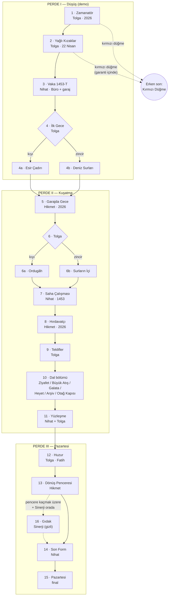
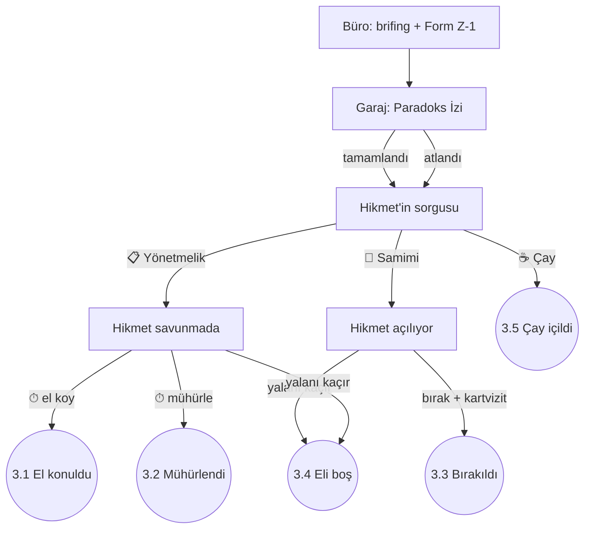
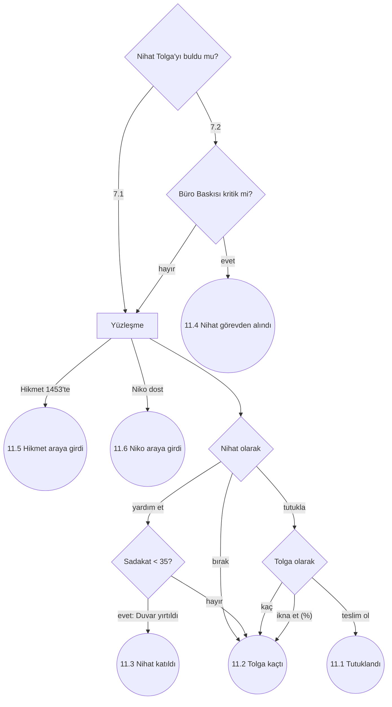

# Bölümler, Akış Şemaları ve Kaderler — v1.1
### Detroit: Become Human yapısının *Gerçek Tarih Bu Değil*'e uyarlanması

> Bu belge oyunun **ana yapısını** tanımlar. Diğer belgeler bu yapının parçalarıdır:
> - [STORY_BRANCHES.md](STORY_BRANCHES.md): Tolga'nın 1453'teki dalları. Bu yapıda sonlar 1–9 **Dünya sonuçlarıdır** (W1–W9), Kırmızı Düğme ise erken sondur.
> - [ITEM_REACTIONS.md](ITEM_REACTIONS.md): Eşya tepkileri.
> - [GDD.md](GDD.md): Genel tasarım, mizah ve yazım kuralları.
> - [STORY_REVIEW.md](STORY_REVIEW.md): Bu sürümdeki düzeltmelerin gerekçeleri.
>
> **v1.1 değişiklikleri:** Kalite kontrolündeki bütün düzeltmeler işlendi. Perde I yeniden sıralandı (bölüm numaraları değişti), zaman yolculuğu kuralları eklendi (§2), Lütfi'nin teklifi ve Heyet dal bölümü eklendi, Kural Sadakati yeniden dengelendi.

---

## 0. Özet: rakamlarla

| | Sayı |
|---|---:|
| Oynanabilir karakter | **3** (Tolga, Denetçi Nihat, Hikmet Amca) + 1 gizli (tavuk Sinerji) |
| Bölüm | **16** (15 ana + 1 gizli), 3 perde |
| Toplam oynanış (tek oyun) | ≈ 3–3,5 saat |
| Dal noktası (yönü değiştiren karar) | **41** |
| Süreli karar (⏱) | **12** |
| Bölüm sonucu (akış şemasındaki sonuç düğümleri) | **87** |
| Kalıcı durum göstergesi | **6** (Paradoks, Merak, Kural Sadakati, Hikmet ↔ Nihat, Telsiz Bağı, Büro Baskısı) |
| Karakter kaderi | Tolga **4** · Hikmet **3** · Nihat **4** · Sinerji **3** |
| Dünya sonucu | **9** + her birinin "düzeltildi" varyantı (7) = **16** |
| Final kombinasyonu (geçerli) | **357** |
| Adlandırılmış final | **15** + Kırmızı Düğme erken sonu = **16** |

**Demo:** Perde I (Bölüm 1–4), ≈ 32 dk. Oynanabilir karakterler Tolga ve Nihat; Hikmet telsizden sürekli oyunda. 1453'te ≈ 14 dk geçer. Demo, Nihat'ın 1453'e indiği kapanış sahnesiyle biter.

---

## 1. Detroit'ten neyi alıyoruz

| Detroit: Become Human | Gerçek Tarih Bu Değil | Açıklama |
|-----------------------|----------------------|----------|
| Üç oynanabilir karakter (Kara, Connor, Markus) | **Tolga** (1453'te tarihi değiştiren), **Denetçi Nihat** (onu arayan), **Hikmet Amca** (2026'da onu geri getirmeye çalışan) | Bölümler karakterler arasında sırayla geçer, hikayeler kesişir |
| Her bölümün sonunda akış şeması | Aynısı. Görülen yol, kilitli düğümler ve diğer oyuncuların yüzdeleri (§9) | Oyunun omurgası |
| Karakterler kalıcı olarak ölebilir, hikaye onlarsız devam eder | **Kimse ölmez.** Ama karakterler kalıcı olarak **kaybedilebilir**: Tolga 1453'te kalabilir, Hikmet'in makinesine el konulabilir, Nihat görevden alınıp yerine "yeni model" gelebilir | Ton kuralı: komedi. Kayıplar kalıcıdır, ama trajik değil absürttür |
| Connor'ın "yazılım kararsızlığı" ve kırmızı duvar | Nihat'ın **Kural Sadakati** göstergesi ve **Yönetmelik Duvarı** sahnesi: Nihat ilk kez bir formu yırtar | Nihat "kuralsız" olabilir (§4.3) |
| Connor ↔ Hank ilişkisi | **Hikmet ↔ Nihat** ilişkisi: sorgulayanla sorgulanan, zamanla tuhaf bir ikili | 5 kademe (§4.4) |
| Kamuoyu göstergesi | **Büro Baskısı**, Vikipedi tartışma sayfasının "ısısı" | Tarih bozuldukça Nihat'ın amirleri sinirlenir |
| Olay yeri yeniden yapılandırma | Nihat'ın **Paradoks İzi** analizi | Leblebi kabukları, fes izleri, koli bandı parçaları |
| Müzakere başarı yüzdesi | **İkna olasılığı %**: Hikmet sorgusu, Fatih huzuru, Nihat–Tolga yüzleşmesi | Ekranın köşesinde canlı değişir |
| Süreli kararlar ve QTE'ler | 12 süreli karar (⏱) ve 4 QTE bölümü | Tolga panikledikçe süre kısalır |
| Ana menüdeki Chloe | Ana menüde **Hikmet Amca**. Oyuncunun kararlarına yorum yapar, finalde bir istekte bulunur (§10) | Oyunun dördüncü duvarı |
| Bölümü yeniden oynama | Akış şemasından herhangi bir kontrol noktasına dönüş | Sonraki bölümler yeniden hesaplanır, uyarıyla |
| Dergiler (koleksiyon) | Vikipedi sayfa varyantları ve selfie albümü | Tarih değiştikçe yeni sayfalar açılır |

---

## 2. Zaman yolculuğu kuralları

Oyuncunun ilk soracağı sorular burada cevaplanır. Bu kurallar oyunda karakterlerin ağzından söylenir, sadece belgede kalmaz.

### 2.1 Telsiz-Kumanda
Hikmet, Bölüm 1'de bir telsizle bir TV kumandasını koli bandıyla birbirine yapıştırıp Tolga'nın çantasına koyar:
> *"Bu telsiz, bu kumanda. Kırmızı düğme acil dönüş. Diğer düğmeler... kanal değiştiriyor olabilir."*

Oyundaki bütün dönüş mekanikleri bu tek nesneye bağlıdır: kırmızı düğme, Fatih'in tamiri (gizli son), Hikmet'in sakladığı yedek kumanda ve Sinerji'nin gagaladığı düğme. Çanta slotu kaplamaz; her zaman Tolga'nın kemerine bantlıdır.

### 2.2 Kırmızı düğme: iade garantisi
> Hikmet: *"İlk 10 dakika koşulsuz iade garantisi var evlât. Sonrası... garanti dışı."*

- Düğme, 2026 saatiyle kalkıştan sonraki **ilk 10 dakika** çalışır. Bu, 1453'te yaklaşık 4 saate, yani Bölüm 2'nin (kızak kaçışı) sonuna denk gelir.
- Garanti bittikten sonra düğmeye basılırsa sadece cızırdar. Hikmet: *"Garanti bitti. Ben bir şey yapacağım, bekle."* Ama basış Hikmet'e bir sinyal olarak ulaşır: **Telsiz Bağı +1** (Tolga eve dönmek istediğini göstermiştir, en fazla bir kez).
- Düğme, ancak Hikmet 2026'dan bir **dönüş penceresi** açtığında yeniden çalışır (Bölüm 13).

### 2.3 Yönetmelik 7/c: anomali, geldiği araçla iade edilir
> Nihat (Bölüm 3): *"Yönetmelik 7/c. Anomali, geldiği araçla iade edilir. Büro araçları yalnızca kadrolu personel taşır. Yani Bay Tolga'yı ben getiremem. Sizin... şeyinizle dönmesi gerekir."*

- Bu kural Hikmet'i ve makinesini vazgeçilmez yapar.
- Kuralsız Nihat bile bu kuralı çiğneyemez: Büro'nun makinesi kadrosuz birini fiziksel olarak kabul etmez (denenirse Tolga makineden geri tükürülür, bir skeç).
- **İstisna:** Tolga Büro'ya katılırsa (T4) artık kadrolu personeldir ve Büro araçlarıyla dönebilir.

### 2.4 Zaman oranı
**2026'daki 1 saat = 1453'te yaklaşık 1 gün.** Hikaye **pazar gecesi 03:12**'de başlar. Tolga'nın pazartesi 07:30 servisine yetişmesi gerekir. Bu, Hikmet'in bölümlerine doğal bir saat baskısı ekler.

| 2026 | 1453 | Bölüm |
|------|------|-------|
| Pazar gecesi 03:12 | — | 1 · Zamanatör |
| 03:20 (kalkış) | 22 Nisan, sabah | 2 · Yağlı Kızaklar |
| 03:30–04:00 | 22 Nisan | 3 · Vaka 1453-T |
| ≈ 03:50 | 22 Nisan, akşam | 4 · İlk Gece |
| 04:00 | 22–23 Nisan | 5 · Garajda Gece |
| 04:20–05:20 | 23–24 Nisan | 6 · Ordugâh / Surların İçi |
| (Büro zaman dışıdır) | 24 Nisan | 7 · Saha Çalışması |
| 05:00 | 24 Nisan | 8 · Hırdavatçı |
| 06:20 | 25 Nisan | 9 · Teklifler, 10 · Dal, 11 · Yüzleşme |
| 07:10 | 26 Nisan, sabah | 12 · Huzur |
| 07:15 | 26 Nisan, öğle | 13 · Dönüş Penceresi |
| (zaman dışı) | — | 14 · Son Form |
| **Pazartesi 07:30** | — | 15 · Pazartesi |

- Zaman Bürosu **zaman dışında** durur. Nihat istediği ana inebilir; bu yüzden onun bölümleri tabloya esnek yerleşir.
- Tolga'nın 1453 macerası 22–26 Nisan arasında geçer. Konstantinos'un mektubu tarihte Mayıs sonuna aittir; oyunda erkene alındığı GDD §15'te belirtilmiştir.

### 2.5 Değişmez kural
- **Tolga dönerse** dış hayatı hiç değişmez ve değişen dünyayı fark etmez.
- **Tolga dönemezse** ofiste yokluğunu kimse fark etmez.
- **Değişiklikleri fark eden tek kişi Hikmet Amca'dır.** Kimse ona inanmaz.
- **İç dünya biraz değişebilir:** Tolga huzurda dürüst davrandıysa, finaldeki pazartesi toplantısında hayatında ilk kez *"Bilmiyorum. Araştırıp döneyim."* der (§7, Bölüm 15).

---

## 3. Karakterler

### 3.1 Tolga — "tarihi değiştiren" (Markus'un karşılığı)
- **Bölümleri:** 1, 2, 4, 6, 9, 10, 12.
- Kararları dünyayı değiştirir (Paradoks, Dünya sonucu).
- **Yayı:** Oyunun teması, *bildiğini sanmak ile bilmek arasındaki farktır.* Tolga "20 belgesel izledim" diye başlar. Fatih'in en çok ödüllendirdiği şey dürüst bir "bilmiyorum"dur. Oyuncu bunu keşfederse Tolga finalde küçük ama gerçek bir adım atar.

### 3.2 Denetçi Nihat Zamanoğlu — "peşine düşen" (Connor'ın karşılığı)
- Zaman Bürosu'nun en kıdemli (ve en sabırlı) denetçisi. Vaka: **"1453-T, fesli anomali"**.
- 1453'e o da yanlış kıyafetle gider: 1920'lerden kalma fötr şapka, yelek ve bir daktilo. Büronun kostüm deposu da Tolga'nın kostümcüsü kadar dikkatsizdir.
- **Bölümleri:** 3, 7, 11, 14.
- **Göstergeleri:** Kural Sadakati, Hikmet ↔ Nihat, Büro Baskısı.
- **Yayı:** Kuraldan empatiye.
- **Form Z-1 sırrı:** Nihat'ın odasının duvarında Büro'nun kuruluş belgesi **Form Z-1** çerçeveli olarak asılıdır. İmza kısmında sadece **"T."** yazar. Nihat: *"Kurucumuz. Kimse kim olduğunu bilmiyor."* Arşiv dalında (W8) bu imzanın Tolga'ya ait olduğu ortaya çıkar. Diğer yollarda sonraki bölümün gizemi olarak kalır.

### 3.3 Hikmet Amca — "geride kalan" (Kara'nın karşılığı)
- Zamanatör'ün mucidi. 2026'da, garajında, makinesini Büro'dan korumaya ve Tolga'yı geri getirmeye çalışır.
- **Bölümleri:** 5, 8, 13 (ve demoda Bölüm 1 ile telsiz üzerinden).
- **Göstergesi:** Telsiz Bağı.
- **Özelliği:** Tolga'nın 1453'te yaptığı her değişikliği fark eden tek kişidir.
- **Geçmişi ve yayı:** Hikmet makineyi yıllar önce **kendisi için** yapmaya başlamıştır. 1977'de, mahallenin bir düğününde dans etmeye kalkmadığı o geceye geri dönmek istemiştir, ama makine hazır olduğunda binmeye hiç cesaret edememiştir. Tolga'yı göndermesi, kendi korkusunun bedelini başkasına ödetmesidir. Bölüm 5'te bunu itiraf eder (tek samimi anı). Bölüm 8'deki *"makineye bin"* kararı, Hikmet'in kendi korkusunu yenmesi anlamına gelir. Ana menüdeki *"Bir kere de ben gitsem?"* sorusu bu yayın sonudur.

### 3.4 Sinerji — gizli karakter
Niko'nun tavuğu. Gizli Bölüm 16'da 90 saniyeliğine oynanır. Sadece Bizans'tan geçen oyunlarda Tolga'ya katılır.

---

## 4. Kalıcı göstergeler

Göstergeler bölümler arasında taşınır. **Ekranda (HUD) sadece o bölümün karakterine ait göstergeler görünür.** Paradoks ve Büro Baskısı oyun sırasında hiç görünmez; sadece bölüm sonundaki akış şemasında gösterilir. Böylece oyuncu aynı anda en fazla 2–3 sistemi takip eder.

| Gösterge | Kimin | Oyun sırasında görünür mü? |
|----------|-------|:--------------------------:|
| Paradoks | Dünya | Hayır (Vikipedi ve Hikmet'in paniğinden anlaşılır) |
| Merak / İkna % | Fatih | Sadece Bölüm 12'de |
| Kural Sadakati | Nihat | Nihat'ın bölümlerinde |
| Hikmet ↔ Nihat | İkisi | Hayır (diyaloglardan anlaşılır) |
| Telsiz Bağı | Tolga ↔ Hikmet | Tolga'nın ve Hikmet'in bölümlerinde |
| Büro Baskısı | Nihat | Hayır |

### 4.1 Paradoks (dünya)
GDD §7.8. 0–100. Dünya sonucunu ve Denetçi'nin baskısını belirler.

### 4.2 Merak (Fatih) ve İkna olasılığı
GDD §9.6. Bölüm 12'de **İkna olasılığı %** olarak canlı gösterilir:

| Merak | 0 | 1 | 2 | 3+ |
|-------|:-:|:-:|:-:|:--:|
| İkna olasılığı | %10 | %40 | %70 | %100 |

### 4.3 Kural Sadakati (Nihat)
- **60'tan başlar.** Nihat'ın empatik, esnek ya da kural dışı her kararı düşürür, kurala bağlı kararlar yükseltir.
- **Görünümü:** Ekranın köşesinde bir damga ikonu. Sadakat düştükçe damga soluklaşır ve çatlar.
- **Eşikler:**
  - **50+ Kurala Sadık:** Nihat her şeyi forma döker.
  - **35–49 Tereddüt:** Nihat'ın diyaloglarında "ama" kelimesi çoğalır.
  - **< 35 Yönetmelik Duvarı:** Bölüm 7'de ya da Bölüm 11'de (Nihat "Yardım et" seçeneğine yöneldiğinde) özel bir sahne tetiklenir. Nihat'ın önünde dev bir yönetmelik metni belirir (Connor'ın kırmızı duvarının karşılığı). Oyuncu bir formu yırtmak için tuşa art arda basar. Yırtarsa Nihat **Kuralsız** olur. Yırtmazsa sadakat 50'ye döner ve bir daha bu sahne gelmez.

| Karar | Bölüm | Etki |
|-------|:-----:|-----:|
| Hikmet'in çayını kabul etmek | 3 | −15 |
| Makineye el koymamak, kartvizit bırakmak | 3 | −10 |
| Hikmet'in telefonunu açıp dinlemek | 5, 8 | −5 (her biri) |
| Nöbetçilerin çay molasına katılmak (ordugâh) | 7 | −10 |
| Theodoros'la meslek sohbeti (Bizans) | 7 | −10 |
| Tolga'nın kaçmasına göz yummak | 11 | −20 |
| Bir tarihi kişiye form doldurtmak | 7 | +10 |
| Tolga'yı tutuklamak | 11 | +20 |

**Denge kontrolü:**
- **Bölüm 7'de Duvar:** 60 − 15 (çay) − 5 (Bölüm 5 telefon) − 10 (mola ya da Theodoros) = **30** → tetiklenir. Sadece en empatik yol seçilirse.
- **Bölüm 11'de Duvar:** 60 − 10 (kartvizit) − 5 − 10 − 5 (Bölüm 8 telefon) = **30** → tetiklenir.
- **Hiç empatik karar verilmezse:** Sadakat 60–80 arasında kalır ve Nihat sadık biter (N1).

### 4.4 Hikmet ↔ Nihat ilişkisi
Beş kademe: **Düşman · Soğuk · Nötr · Dost · Ortak**. Bölüm 3'teki sorguda başlar, Bölüm 8, 13 ve 14'te belirleyici olur.
- **Ortak** olan ikili, Bölüm 13'te pencereyi birlikte açar (en uzun pencere).
- **Düşman** kademesinde Nihat, Bölüm 13'te Hikmet'i engellemeye çalışır.

### 4.5 Telsiz Bağı (Tolga ↔ Hikmet)
- 0–5, **2'den başlar.** Tolga'nın Hikmet'in telsiz çağrılarına cevap verip vermediğine, garanti sonrası düğmeye basmasına (+1, bir kez) ve Hikmet'in Bölüm 5 ile 8'deki kararlarına göre değişir.
- **Etkisi:** Bölüm 13'teki dönüş penceresinin süresi. Bağ 5 ise 12 saniye, 0 ise 3 saniye.
- **Görünümü:** Telsiz-Kumanda'nın sinyal çubukları.

### 4.6 Büro Baskısı (kamuoyunun karşılığı)
- Vikipedi tartışma sayfasının "ısısı". Paradoks yükseldikçe ve Nihat başarısız oldukça artar.
- **Eşikler:** Düşük / Orta / Yüksek / **Kritik**. Kritik olursa Bölüm 11'den sonra Nihat görevden alınır ve yerine **yeni model Nihat** gelir (N3).

---

## 5. Kaderler

### Tolga
| Kod | Kader | Nasıl |
|-----|-------|-------|
| **T1** | **Döndü** | Bölüm 13'te pencere açıkken kırmızı düğmeye basıldı ya da Fatih Telsiz-Kumanda'yı tamir etti |
| **T2** | **1453'te kaldı** | Pencere kaçırıldı; Sinerji de kurtaramadı |
| **T3** | **Başka bir yıla savruldu** | Makine yarım tamirle çalıştırıldı (sonraki bölümün kancası) |
| **T4** | **Büroya katıldı** | Bölüm 14'te Nihat onu işe önerdi. Kadrolu olduğu için Büro aracıyla döner (§2.3). Gündüz sigortacı, gece Zaman Bürosu stajyeri |

### Hikmet
| Kod | Kader | Nasıl |
|-----|-------|-------|
| **H1** | **Makine elinde** | Makineyi korudu ya da geri aldı |
| **H2** | **Makineye el konuldu** | Bölüm 3'te el konuldu ve geri alınamadı |
| **H3** | **1453'e gitti** | Bölüm 8'de Tolga'yı kurtarmak için makineye kendisi bindi. Pijamayla. |

### Nihat
| Kod | Kader | Nasıl |
|-----|-------|-------|
| **N1** | **Kurala sadık** | Duvar'da form yırtılmadı ya da Duvar hiç gelmedi |
| **N2** | **Kuralsız** | Yönetmelik Duvarı'nda formu yırttı |
| **N3** | **Yerine yeni model geldi** | Büro Baskısı kritik. Yeni Nihat eskisinin aynısıdır ama daha az sabırlıdır ve Tolga'yı tanımaz |
| **N4** | **İstifa etti** | Bölüm 14'te rozetini bıraktı. Hikmet'le ortak olur |

### Sinerji
| Kader | Nasıl |
|-------|-------|
| **1453'te kaldı** | Varsayılan (ya da Bizans'a hiç gidilmedi) |
| **2026'ya geldi** | Bölüm 13'te Tolga'yla birlikte pencereden geçti |
| **Kahraman** | Gizli Bölüm 16'da pencereyi kurtardı |

---

## 6. Bölümler

### 6.1 Genel akış

### 6.2 Bölüm listesi

| # | Başlık (TR / EN) | Karakter | 2026 / 1453 | Süre | Dal noktası | Sonuç |
|---|------------------|----------|-------------|-----:|:-----------:|:-----:|
| 1 | **Zamanatör** / *The Chrono-Matic* | Tolga | Pazar gecesi 03:12, garaj | 6 dk | 3 | 3 |
| 2 | **Yağlı Kızaklar** / *Greased Slipways* | Tolga | 22 Nisan, sabah | 6 dk | 2 | 5 |
| 3 | **Vaka 1453-T** / *Case 1453-T* | Nihat | Zaman Bürosu, garaj | 12 dk | 3 | 5 |
| 4 | **İlk Gece** / *First Night* (4a · 4b) | Tolga | 22 Nisan, akşam | 8 dk | 2 | 6 |
| 5 | **Garajda Gece** / *Night in the Garage* | Hikmet | 04:00 | 8 dk | 3 | 4 |
| 6 | **Ordugâh** / **Surların İçi** (6a · 6b) | Tolga | 23–24 Nisan | 12 dk | 4 | 11 |
| 7 | **Saha Çalışması** / *Fieldwork* | Nihat | 24 Nisan | 12 dk | 3 | 6 |
| 8 | **Hırdavatçı** / *The Hardware Shop* | Hikmet | 05:00 | 8 dk | 3 | 4 |
| 9 | **Teklifler** / *Offers* | Tolga | 25 Nisan | 5 dk | 5 | 6 |
| 10 | **Dal bölümü** (6 farklı bölüm) | Tolga | 25 Nisan | 10 dk | 6 | 12 |
| 11 | **Yüzleşme** / *Confrontation* | Nihat + Tolga | 25 Nisan, gece | 8 dk | 2 | 6 |
| 12 | **Huzur** / *The Audience* | Tolga | 26 Nisan, sabah | 10 dk | 1 | 6 |
| 13 | **Dönüş Penceresi** / *The Window* | Hikmet | 07:15 | 8 dk | 2 | 6 |
| 14 | **Son Form** / *The Final Form* | Nihat | Zaman Bürosu | 6 dk | 1 | 5 |
| 15 | **Pazartesi** / *Monday* | Hepsi | Pazartesi 07:30 | 6 dk | — | final |
| 16 | **Gıdak** / *Cluck* (gizli) | Sinerji | Pencerenin önü | 1,5 dk | 1 | 2 |
| | **Toplam** | | | | **41** | **87** |

*Tek oyunda 4a/4b ve 6a/6b'den biri (aynı taraf) ve 10'un altı bölümünden biri oynanır. Süre ≈ 3–3,5 saat.*

---

## PERDE I — Düşüş (demo)

### Bölüm 1 — Zamanatör *(Tolga · pazar gecesi 03:12)*
Garaj bölümü (GDD §9.1), 6 dakikaya kısaltılmış: açılış uyarısı, kostüm, çanta, **Telsiz-Kumanda** ve iade garantisi (§2.1–2.2), 1453 → 14:53.

**Dal noktaları:**
- **Çanta:** 10 eşyadan 5'i (bütün oyunu etkiler).
- **Fes:** Başlangıçta takılı mı?
- **⏱ Tekmeyi kim atacak?** Makine takılır. Hikmet: *"Tekme lazım!"* 5 saniyelik süre.

**Sonuçlar:**
| ID | Sonuç | Taşınan etki |
|----|-------|--------------|
| 1.1 | Hikmet tekmeyi attı | Standart |
| 1.2 | Tolga tekmeyi attı | Telsiz Bağı +1. Makinenin paneli çatlar, Bölüm 8'de Hikmet'in işi zorlaşır |
| 1.3 | Kırmızı düğmeye basıldı | **Erken son: Kırmızı Düğme** (makine henüz çalışmadan: *"Daha gitmedin ki."*) |

### Bölüm 2 — Yağlı Kızaklar *(Tolga · 22 Nisan, sabah)*
Kızak kaçışı (GDD §9.2). QTE bölümü. Kırmızı düğmenin garantisi bu bölümün sonunda biter; Hikmet telsizden geri sayar: *"Garantinin bitmesine iki dakika!"*

**Dal noktaları:** ⏱ Kızak QTE'leri · ⏱ Haliç'te kıyıya ya da zincire yüzmek.

**Sonuçlar:**
| ID | Sonuç | Taşınan etki |
|----|-------|--------------|
| 2.1 | Kıyıya çıktı, yakalandı | 4a esir çadırından başlar |
| 2.2 | Kıyıya çıktı, yakalanmadı (kusursuz QTE) | 4a pazar yerinde, saklanarak başlar; "Frenk casusu" etiketi yok |
| 2.3 | Zincire ulaştı | 4b |
| 2.4 | Zincirden düştü, kıyıya sürüklendi | 4a esir çadırından başlar, Tolga ıslak (Şüphe +1 bütün bölüm) |
| 2.5 | Kırmızı düğmeye basıldı (garanti içinde) | **Erken son: Kırmızı Düğme** |

### Bölüm 3 — Vaka 1453-T *(Nihat · Zaman Bürosu ve garaj)*
Connor'ın ilk bölümüne karşılık gelir. Nihat tanıtılır. **Büro sahnesi bölümün yarısıdır:** zaman dışında duran, sonsuz koridorlu, her dönemden kostümlerin asılı olduğu bir devlet dairesi. Oyuncu burada ilk kez yeni ve büyük bir mekân görür.

**Akış:**
1. **Büro (≈6 dk):** Nihat'ın odası (duvarda **Form Z-1**, imza: *"T."*). Amiri brifing verir: *"Fesli bir anomali. İstanbul, 1453. Yine."* Kostüm deposu: Nihat'a 1920'lerden kalma bir fötr şapka verilir.
2. **Hikmet'in garajı (≈6 dk):** **Paradoks İzi** analizi (Nihat, Tolga'nın kalkışını yeniden yapılandırır: holografik bir Hikmet makineye tekme atar) → Hikmet'in sorgusu → Nihat **Yönetmelik 7/c**'yi açıklar (§2.3).

**Sorgu mekaniği:** Ekranın köşesinde **"Doğruyu söyletme olasılığı %"**. Nihat'ın yaklaşımı:
- 📋 Yönetmelik: *"Madde 14/b uyarınca..."* (+%10, ilişki −1)
- 🙂 Samimi: *"Bu makineyi siz mi yaptınız? Etkileyici."* (+%15, ilişki +1)
- ☕ Çay: Hikmet'in ikram ettiği çayı kabul etmek (+%20, ilişki +1, Sadakat −15)

**Dal noktaları:** Sorgu yaklaşımı · ⏱ Makineye ne yapılacak? · Kartvizit bırakılsın mı?

**Sonuçlar:**
| ID | Sonuç | Taşınan etki |
|----|-------|--------------|
| 3.1 | Makineye el konuldu | Hikmet ↔ Nihat: **Düşman**. Bölüm 5 ve 8 zorlaşır |
| 3.2 | Makine mühürlendi | **Soğuk**. Hikmet mührü kırmak zorunda kalır |
| 3.3 | Makine bırakıldı, kartvizit verildi | **Nötr**, Sadakat −10. Bölüm 5 ve 8'de Hikmet, Nihat'ı arayabilir |
| 3.4 | Hikmet yalan söyledi ve Nihat anlamadı | Nihat eli boş döner, Büro Baskısı +1 |
| 3.5 | Çay içildi, Hikmet her şeyi anlattı | **Dost**, Sadakat −15 |

### Bölüm 4 — İlk Gece *(Tolga · 22 Nisan, akşam)*
Eski ordugâh ve Bizans bölümlerinin ilk yarısı. Garanti bitmiştir; Tolga ilk kez gerçekten 1453'te **mahsur** olduğunu anlar.

**4a · Esir Çadırı** (kıyıdan gelenler): Hasan ile Hüseyin'in "kim kim" tartışmasını kullanarak kaçış (GDD §9.3). 2.2'den gelenler pazar yerinde saklanarak başlar.
**4b · Deniz Surları** (zincirden gelenler): Zincir denge bölümü, Niko'nun surdan laf atması ve tavuk fırlatması, Sinerji'nin Tolga'ya katılması (GDD §9.4).

**Dal noktaları:** Kaçış yöntemi (4a) ya da fes kararı Niko'nun önünde (4b) · Garanti sonrası kırmızı düğmeye basmak (Telsiz Bağı +1).

**Sonuçlar:**
| ID | Sonuç | Taşınan etki |
|----|-------|--------------|
| 4a.1 | Nöbetçiler tartışırken kaçtı | Standart |
| 4a.2 | Nöbetçileri eşyayla atlattı (☕ mola, 🧊, 📦) | Hasan ile Hüseyin Tolga'yı sever, Bölüm 7'de Nihat'a yanlış yönü gösterirler |
| 4a.3 | Kaçamadı, bulaşığa verildi | Bölüm 6a mutfakta başlar (Yol A'ya kestirme) |
| 4b.1 | Niko'ya "Türk casusu" olarak yakalandı (fesli) | Niko onu rehber gibi dolaştırır |
| 4b.2 | "Frenk tüccarı" olarak içeri alındı (fessiz) | Bizans'ta Şüphe düşük başlar |
| 4b.3 | Surdan düştü, sabahı hücrede bekledi | Zindan formu skeci; Bölüm 7'de Nihat'ın işi kolaylaşır |

**Demo kapanışı (bölüm sonu sahnesi):** Kamera 1453'ün gece gökyüzüne kalkar. Bir ışık çakar. Tepede fötr şapkalı, yelekli, elinde daktilo olan bir adam belirir: Nihat. Uzakta, bir kamp ateşinin ışığında kırmızı bir fes görünür. Nihat daktilosuna bir satır yazar: *"Anomali tespit edildi."* **Demo burada biter.** Akış şeması açılır ve kilitli Perde II düğümleri görünür.

---

## PERDE II — Kuşatma

### Bölüm 5 — Garajda Gece *(Hikmet · 04:00)*
Kara'nın ilk bölümlerine karşılık gelir: küçük bir mekân, yalnız bir karakter, koruma ve kaçış. Oyuncu Hikmet'i ilk kez oynar.

**Akış:** Hikmet garajda yalnızdır. Tolga'nın ilk kararları yüzünden dünyada küçük değişiklikler başlamıştır; radyodaki spiker *"Leb... İstanbul'da bugün hava..."* diye takılır. Hikmet telsizle Tolga'ya ulaşmaya çalışır. Garajın önünde Büro'nun gri minibüsü bekler.

**Samimi an (bölümün tek ciddi anı, §GDD 4):** Hikmet boş garajda, telsize konuşur. Tolga cevap vermez. Hikmet makineyi neden yaptığını anlatır: 1977, mahalle düğünü, dans etmeye kalkmadığı o gece. *"Makineyi bitirdim, sonra binemedim. Seni gönderdim. Kusura bakma evlât."* Üç saniye sessizlik. Sonra telsizden Tolga'nın sesi gelir: *"Hikmet Amca? Yanlışlıkla bastım. Burada bir tavuk var."* (Bizans'tan gelenlerde tavuk; ordugâhtan gelenlerde *"Burada biri bana bulaşık yıkatıyor."*)

**Dal noktaları:** Makineyi sakla / tamir etmeye başla · ⏱ Telsiz frekansı (Tolga'ya ulaş) · Nihat'ın kartvizitindeki numarayı ara (3.3 ise).

**Sonuçlar:**
| ID | Sonuç | Taşınan etki |
|----|-------|--------------|
| 5.1 | Makine bodruma saklandı | H1 yolu korunur |
| 5.2 | Makineye el konulmuştu ama Hikmet yedek Telsiz-Kumanda'yı sakladı | 3.1 sonrası tek umut; Bölüm 8'de depo planı açılır |
| 5.3 | Hikmet Nihat'ı aradı ve her şeyi anlattı | İlişki +1, Büro Baskısı −1, Nihat'ın Sadakati −5 |
| 5.4 | Tolga'ya ulaşılamadı | Telsiz Bağı −2 |

### Bölüm 6a — Ordugâh *(Tolga · 23–24 Nisan)*
Ordugâh bölümünün devamı (GDD §9.3): yol seçimi ve yan içerik. Nihat'ın Bölüm 7'de bulacağı **izler** burada bırakılır: leblebi kabukları, çakmak kokusu, Urban'ın cin hikayesi.

**Dal noktaları:** Yol A / B / C / Y · Çandarlı'nın adamı (Yol Y'de **garanti** çıkar, diğer yollarda pazar arkasında bulunmalıdır) · Eşya "Ver" kararları · Hikmet'in telsiz çağrısına cevap ver/verme.

**Sonuçlar:**
| ID | Sonuç | Taşınan etki |
|----|-------|--------------|
| 6a.1 | Yol A: mutfak | Kadri'nin teklifi (Bölüm 9) |
| 6a.2 | Yol B: tercüman | Lütfi'nin teklifi (Bölüm 9) |
| 6a.3 | Yol C: topçu | Urban'ın teklifi (Bölüm 9) |
| 6a.4 | Yol Y: pazar | Çandarlı'nın teklifi garanti (Bölüm 9); Nihat'ın izi en zor sürdüğü yol |
| 6a.5 | Çandarlı'nın mektubu alındı *(ek, her yolda)* | Çandarlı'nın teklifi (Bölüm 9) |

### Bölüm 6b — Surların İçi *(Tolga · 23–24 Nisan)*
Bizans bölümünün devamı (GDD §9.4): Bizans Labirenti, Giustiniani, Konstantinos, mektup.

**Dal noktaları:** Fes · Labirent · ⏱ Giustiniani'yi uyar · Mektubu aç.

**Sonuçlar:**
| ID | Sonuç | Taşınan etki |
|----|-------|--------------|
| 6b.1 | Labirent kusursuz | Theodoros'un teklifi (Bölüm 9) |
| 6b.2 | Labirent tamamlandı | Standart |
| 6b.3 | Labirent başarısız, zindan | Nihat Tolga'yı Bölüm 7'de kolayca bulur |
| 6b.4 | Niko dost *(ek)* | Bölüm 11'de Niko araya girer |
| 6b.5 | Giustiniani uyarıldı *(ek)* | Paradoks +30, Büro Baskısı +2 |
| 6b.6 | Mektup açıldı *(ek)* | Paradoks +15 |

### Bölüm 7 — Saha Çalışması *(Nihat · 24 Nisan)*
Nihat Tolga'nın **Paradoks İzleri**ni takip eder. Hangi yolda olduğuna göre farklı yerlerde farklı insanlarla karşılaşır: ordugâhta Hasan ile Hüseyin ya da Lütfi, Bizans'ta Theodoros ya da Niko.

**Dal noktaları:** Hangi izi takip edecek · Bir tarihi kişiye form doldurtsun mu · ⏱ Yönetmelik Duvarı (Sadakat < 35 ise).

**Sonuçlar:**
| ID | Sonuç | Taşınan etki |
|----|-------|--------------|
| 7.1 | Tolga'nın yeri bulundu | Bölüm 11'de tam yüzleşme |
| 7.2 | İz kaybedildi | Büro Baskısı +2; Bölüm 11'de Nihat Tolga'yı bulamayabilir |
| 7.3 | Theodoros'la meslek dostluğu *(Bizans)* | Sadakat −10; Arşiv dalı için gerekli |
| 7.4 | Nöbetçilerin çay molasına katıldı *(ordugâh)* | Sadakat −10 |
| 7.5a | Yönetmelik Duvarı: form yırtıldı | **Nihat Kuralsız (N2)** |
| 7.5b | Yönetmelik Duvarı: form yırtılmadı | Sadakat 50'ye döner, sahne bir daha gelmez |

### Bölüm 8 — Hırdavatçı *(Hikmet · 05:00)*
Hikmet, makineyi tamir etmek için gece açık tek hırdavatçıya gider. Büro minibüsü onu izler. Servis saatine iki buçuk saat kalmıştır.

**Önkoşul espri:** Tolga çantaya 📦 koli bandını aldıysa Hikmet'in bandı yoktur. *"Evlât bandımı da götürmüş. Bandsız ben neyim?"* Bant bulmak ayrı bir görev olur.

**Dal noktaları:** Büro ajanlarını atlat (⏱ gizlilik) · Nihat'ı ara (3.3 ise; Nihat'ın Sadakati −5) · ⏱ **Makineye kendin bin** (büyük karar; Hikmet'in yayı §3.3).

**Sonuçlar:**
| ID | Sonuç | Taşınan etki |
|----|-------|--------------|
| 8.1 | Makine tamir edildi | Bölüm 13 standart |
| 8.2 | Parça bulunamadı | Bölüm 13'te pencere daha kısa; T3 (savrulma) riski |
| 8.3 | Büro deposuna girme planı *(makineye el konulduysa)* | Bölüm 13 "depo soygunu" versiyonuyla oynanır |
| 8.4 | **Hikmet makineye bindi** | **H3.** Hikmet pijamasıyla 1453'e iner. Bölüm 11, 12 ve 13 değişir |

### Bölüm 9 — Teklifler *(Tolga · 25 Nisan)*
Yol değiştiren teklifler bu bölümde gelir (STORY_BRANCHES Matris 1). **Her yola en az bir teklif gelir:**

| Yol | Teklif |
|-----|--------|
| 🍲 A | Kadri: *"Ziyafeti sen pişir."* |
| 🗣️ B | **Lütfi: *"Ortak, sultan Bizans'a bir elçi heyeti yolluyor. Tercüman olarak ben gidiyorum, sen de 'Frenk danışman' olarak gel."*** |
| 💣 C | Urban: *"Kal, top dökelim."* |
| 🐐 Y | Çandarlı (garanti): *"Bu mektubu Galata'ya götür."* |
| Ordugâh, her yol | Çandarlı (mektup 6a.5'te alındıysa) |
| 🏛️ Bz | Theodoros (Labirent kusursuzsa): *"Arşivde kal."* |

**Sonuçlar:**
| ID | Sonuç | Sonraki |
|----|-------|---------|
| 9.1 | Kadri'nin teklifi kabul | 10 · Ziyafet |
| 9.2 | Urban'ın teklifi kabul | 10 · Büyük Atış |
| 9.3 | Çandarlı'nın mektubu Galata'ya | 10 · Galata |
| 9.4 | **Lütfi'nin teklifi kabul** | **10 · Heyet** |
| 9.5 | Theodoros'un teklifi kabul | 10 · Arşiv |
| 9.6 | Hepsi reddedildi | 10 · Otağ Kapısı |

### Bölüm 10 — Dal bölümü *(Tolga · 25 Nisan)*
Altı bölümden biri oynanır. Ayrıntılar STORY_BRANCHES §3'tedir. **Her dalda en az bir Fatih sahnesi vardır.**

| Bölüm | Fatih nerede | Başarı | Başarısızlık |
|-------|--------------|--------|--------------|
| **Ziyafet** | Mutfağa gelir | 10Z.1 → **W7** | 10Z.2 Mutfak yanar → Paradoks +30, Denetçi |
| **Büyük Atış** | Sahaya gelir | 10B.1 Gülle Galata'daki fıçıya → **W5** | 10B.2 Gülle 20 metre öteye → **W5** (başka replik) |
| **Galata** | Kıyıdan Galata'yı incelerken Tolga'yla göz göze gelir, başını hafifçe eğer | 10G.1 Venedik gemisinde → **W6** | 10G.2 Mektup Fatih'e getirildi → Merak +1, Bölüm 12 |
| **Heyet** *(yeni)* | Heyeti yollarken ve huzurda | 10H.1 Konstantinos'un mektubu alındı → Bölüm 12 Bizans elçisi olarak (W3 açılır) | 10H.2 Lütfi'nin tercümesi heyeti rezil etti → Bölüm 12, Merak −1 |
| **Arşiv** | Nihat, Tolga'yı "resmî denetim ziyareti" için kısa bir süreliğine otağa götürür. Fatih Büro'nun ilk formunu imzalar: *"Bürokrasinin en iyisi, kısa olanıdır."* | 10A.1 Form Z-1 imzalandı → **W8** | 10A.2 Tolga son anda reddetti → Giustiniani → Bölüm 12 |
| **Otağ Kapısı** | Bölüm 12'de | 10O.1 Kapı geçildi → Bölüm 12 | 10O.2 Kapı geçilemedi → mutfağa gönderildi, Bölüm 12'ye Yol A gibi girilir |

**10 · Heyet (yeni dal, ≈10 dk):** Tolga ve Lütfi, Osmanlı heyetiyle beyaz bayrak altında surların içine girer. Tolga ordugâh yolundan gelmesine rağmen Konstantinos'u ve Niko'yu görür (Labirent ve Giustiniani yoktur). Espri: Lütfi Yunanca bildiğini iddia eder ve Konstantinos'un sözlerini Fatih'e iletilecek şekilde "düzeltir". Tolga iki tercüme arasında sıkışır. Konstantinos mühürlü mektubu Tolga'ya verir (mektubu açma kararı burada da vardır). Bu dal, iki ana yolu birbirine bağlayan tek köprüdür.

**Önemli:** Ziyafet, Büyük Atış, Galata ve Arşiv başarıyla biterse Tolga'nın 1453 hikayesi orada kapanır ve **Bölüm 12 oynanmaz**. Oyun Bölüm 11'den doğrudan 13'e geçer. Heyet ve Otağ Kapısı her zaman Bölüm 12'ye götürür.

### Bölüm 11 — Yüzleşme *(Nihat + Tolga · 25 Nisan, gece)*
Detroit'teki karakterlerin kesiştiği bölümlere karşılık gelir. **Kontrol sahne ortasında el değiştirir:** önce Nihat, sonra Tolga.

**Akış:** Nihat Tolga'yı bulur (7.1) ya da tesadüfen karşılaşır. Nihat: *"Bay Tolga. Form Z-1453'ü doldurmadınız."* Tolga: *"Hangi form?"* Nihat Yönetmelik 7/c'yi hatırlatır: onu kendisi götüremez, sadece tutuklayabilir ya da bırakabilir.

**Süreli diyalog (⏱):** Her iki taraf için de İkna olasılığı % görünür.
- **Nihat olarak:** Tutukla / Rapor et ama bırak / Yardım et. *(Yardım et, Sadakat < 35 ise Yönetmelik Duvarı'nı tetikler; duvar yırtılırsa seçilir.)*
- **Tolga olarak:** Kaç / Teslim ol / İkna et (eşya gösterme dahil: 🥜 Nihat'a leblebi vermek +%15).

**Sonuçlar:**
| ID | Sonuç | Taşınan etki |
|----|-------|--------------|
| 11.1 | Tolga tutuklandı | Bekleme Salonu → Bölüm 14'te W9 ya da T4 |
| 11.2 | Tolga kaçtı | Büro Baskısı +1 |
| 11.3 | Nihat Tolga'ya katıldı *(Kuralsız)* | Nihat Bölüm 12'de otağda Tolga'nın yanında; Bölüm 13'te Hikmet'e pencere için yardım eder |
| 11.4 | Nihat Tolga'yı bulamadı (7.2) | Büro Baskısı kritikse **Nihat görevden alınır (N3)** |
| 11.5 | Pijamalı Hikmet araya girdi *(8.4)* | Hikmet ile Nihat kavga eder (sözlü, formlarla). Tolga kaçar. İlişki kademesi burada sabitlenir |
| 11.6 | Niko araya girdi *(6b.4)* | Sinerji'yi fırlatıp Nihat'ın dikkatini dağıtır; Tolga kaçar (11.2 gibi, ama Büro Baskısı artmaz) |

---

## PERDE III — Pazartesi

### Bölüm 12 — Huzur *(Tolga · 26 Nisan, sabah)*
Huzur bölümü (GDD §9.6). Ekranın köşesinde **İkna olasılığı %** (§4.2).

**Katılımcılar değişir:** Otağa Tolga'yla birlikte kimin geldiğine göre sahne değişir:
- **Hikmet (8.4):** Fatih iki "gelecekli"yi aynı anda dinler. Hikmet makineden bahsetmeye başlayınca Fatih'in ilgisi Tolga'dan Hikmet'e kayar. Tolga kıskanır.
- **Nihat (11.3):** Nihat bir form çıkarır. Fatih formu okur, bir yazım hatası bulur. Nihat gururlanır.
- **Lütfi (Heyet dalı):** Lütfi, Konstantinos'un sözlerini "tercüme etmekte" ısrar eder. Fatih: *"Lütfi, mektup zaten yazılı."*
- **Üçü birden:** *"Sizin zamanınızda herkes mi böyle gelir?"*

**Dürüstlük bayrağı:** Tolga huzurda dürüst bir itiraf yaparsa ("Aslında hiçbir şey bilmiyorum", mektup hakkında dürüstlük ya da kilit soruda "Bunu size söyleyemem") `honest_with_sultan` bayrağı açılır. Bu bayrak Bölüm 15'teki "Bilmiyorum" anını tetikler.

**Sonuçlar:**
| ID | Sonuç | Dünya |
|----|-------|-------|
| 12.1 | Tarih Yerinde | **W1** |
| 12.2 | Leblebipolis | **W2** |
| 12.3 | İki Hükümdar *(Bizans ya da Heyet)* | **W3** |
| 12.4 | Sultan'ın Tamiri: Fatih Telsiz-Kumanda'yı tamir eder | **W4**, Bölüm 13 otomatik başarı |
| 12.5 | Mutfağa gönderildi, kilit soru yeniden | — |
| 12.6 | **Mühendisler Meclisi** *(Hikmet otağdaysa ve Merak ≥ 2)*: Fatih ile Hikmet makineyi birlikte tamir eder | **W4** varyantı; Hikmet de döner |

### Bölüm 13 — Dönüş Penceresi *(Hikmet · 07:15)*
Kara'nın finaline karşılık gelir. Süreli, gergin ve komik bir QTE bölümü. Servise 15 dakika vardır.

**Mekanik:** Hikmet 2026'dan pencereyi açar. Pencere açıkken Telsiz-Kumanda'nın kırmızı düğmesi yeniden çalışır (§2.2). Kontrol son saniyelerde Tolga'ya geçer: Tolga'nın düğmeye basması gerekir. Pencerenin süresi Telsiz Bağı'na bağlıdır (§4.5).

**Versiyonlar:**
| Durum | Bölüm nasıl oynanır |
|-------|---------------------|
| Makine Hikmet'te (H1) | Garajda pencereyi aç |
| Makineye el konuldu (8.3) | Büro deposuna gizlice gir, makineyi bul, pencereyi orada aç. Hikmet ↔ Nihat **Ortak** ise ya da Nihat Kuralsızsa (11.3) Nihat kapıyı açık bırakmıştır |
| Hikmet 1453'te (H3) | Pencereyi **1453'ten**, Urban'ın atölyesinde açmaya çalışır; Tolga yardım eder |
| W4 (Fatih tamir etti) | Bölüm 30 saniyelik bir kutlamaya dönüşür |

**Sonuçlar:**
| ID | Sonuç | Kader |
|----|-------|-------|
| 13.1 | Pencere açıldı, Tolga döndü | **T1** |
| 13.2 | Pencere kaçırıldı | **T2** (Sinerji oradaysa önce Bölüm 16) |
| 13.3 | Yanlış yıl | **T3** |
| 13.4 | Hikmet ile Tolga birlikte döndü *(H3)* | **T1 + H1** |
| 13.5 | Hikmet 1453'te kaldı, Tolga döndü *(H3)* | **T1 + H3** (Hikmet, Urban'ın atölyesinde "baş mühendis") |
| 13.6 | Sinerji pencereyi kurtardı *(Bölüm 16'dan)* | **T1**, Sinerji 2026'ya gelir |

### Bölüm 14 — Son Form *(Nihat)*
Connor'ın son kararlarına karşılık gelir. Nihat, vaka raporunu yazar. **Rapor dünyayı belirler.**

| ID | Rapor | Koşul | Etki |
|----|-------|-------|------|
| 14.1 | **"Tarih düzeltildi."** | Nihat sadık (N1) | Dünya sonucu "düzeltildi" varyantına döner (bir iz kalır) |
| 14.2 | **"Rapor tahrifatı."** | Nihat kuralsız (N2) | Dünya olduğu gibi kalır; Nihat Tolga'yı korur |
| 14.3 | **"Tolga Bey'in Büro'ya alınmasını öneririm."** | Tolga tutuklandı ya da Arşiv yolu (W8) | **T4** |
| 14.4 | **İstifa.** | İlişki Dost ya da Ortak | **N4**, Nihat Hikmet'in garajına gelir |
| 14.5 | *(Yeni model Nihat)* Rapor otomatik "düzeltildi" | N3 | 14.1 ile aynı, ama eski Nihat'ın izi kalır |

### Bölüm 15 — Pazartesi *(final)*
Detroit'in son bölümü gibi, bütün kaderlerin birleştiği yer. Final **dört sahneden** kurulur ve her sahnenin varyantları kaderlere göre seçilir:

1. **Hikmet'in garajı** (H1 / H2 / H3 ya da N4 ile ortaklık)
2. **Nihat'ın masası** (N1 / N2 / N3 / N4)
3. **Pazartesi sabahı servisi ve ofis** (T1 / T2 / T3 / T4 × dünya sonucu)
   - **"Bilmiyorum" anı:** Tolga döndüyse (T1 ya da T4) ve `honest_with_sultan` açıksa, sabah toplantısında müdür bir soru sorar ve Tolga, *"Bilmiyorum. Araştırıp döneyim."* der. Müdür şaşırır, bir an durur, sonra toplantıya devam eder. Bayrak kapalıysa Tolga kendinden emin bir saçmalık söyler (*"Bu konuda 20 belgesel izledim."*).
4. **Final kartı:** Adlandırılmış final (§7) ve bütün kaderlerin özeti (Detroit'in karakter özeti ekranı)

### Bölüm 16 — Gıdak *(gizli · Sinerji)*
**Koşul:** Bölüm 13'te pencere kapanmak üzere (13.2 olacak) ve Sinerji Tolga'yla birlikte (sadece Bizans'tan geçen oyunlarda).
Oyuncu 90 saniyeliğine Sinerji olur. Kamera tavuk yüksekliğindedir. Amaç: Telsiz-Kumanda'nın kırmızı düğmesini gagalamak. Engeller: Hasan ile Hüseyin, bir kedi, bir çuval leblebi (dikkat dağıtıcı).

| ID | Sonuç |
|----|-------|
| 16.1 | Düğme gagalandı → **13.6** |
| 16.2 | Sinerji leblebiye yenik düştü → **13.2** |

---

## 7. Adlandırılmış finaller

Final kartındaki başlık, kaderlerin birleşimine göre seçilir. Birden fazla tutarsa **üstteki** kazanır.

| Öncelik | Final (TR / EN) | Koşul | Pazartesi sahnesi |
|:------:|-----------------|-------|-------------------|
| — | **Kırmızı Düğme** / *The Red Button* | Bölüm 1 ya da 2'de, garanti içinde düğme | Erken son (STORY_BRANCHES §3) |
| 1 | **İki Komşu 1453'te** / *Two Neighbours in 1453* | T2 + H3 | Tolga'nın masası da, Hikmet'in garajı da boş. Kimse fark etmez. 1453'te Urban'ın atölyesinde ikisi koli bandı üzerine tartışır |
| 2 | **Boş Masa** / *The Empty Desk* | T2 | Ofiste Tolga'nın masası boş. Müdür: *"Tolga bugün de mi erken çıktı?"* Hikmet telsizi açık bırakmıştır |
| 3 | **Başka Bir Yıl** / *Another Year* | T3 | Tolga bambaşka bir yılda uyanır. Ekran kararır: *"Bölüm 2 yakında."* |
| 4 | **Kurucu Üye** / *Founding Member* | T4 + W8 | Nihat'ın odasındaki Form Z-1'in altındaki "T." imzasının yanına küçük bir not eklenmiştir: *"Tolga."* Tolga gündüz sigortacı, gece Büro'nun kurucu üyesi |
| 5 | **Gece Mesaisi** / *The Night Shift* | T4 | Tolga gündüz sigortacı, gece Büro stajyeri. Nihat ona form doldurmayı öğretir |
| 6 | **Sultan'ın Tamiri** / *The Sultan's Repair* | W4 | Garajdaki çerçevede Fatih'in portresi. H3 ise *Mühendisler Meclisi* varyantı: Hikmet'in elinde Fatih'in imzaladığı koli bandı |
| 7 | **Form Z-1453** / *Form Z-1453* | W9 | Bekleme salonundan pazartesi sabahına |
| 8 | **Zaman Tamir Servisi** / *Time Repair Co.* | N4 | Garajın kapısında yeni bir tabela: *"Hikmet & Nihat — Zaman Tamir Servisi"* |
| 9 | **Yeni Model** / *The New Model* | N3 | Eski Nihat, Tolga'nın durağında sivil kıyafetle otobüs bekler. Yeni Nihat onun yanından geçer, birbirlerine bakarlar |
| 10 | **Mühürlü Garaj** / *The Sealed Garage* | T1 + H2 | Makine gitmiştir. Hikmet yedek parçalardan *Zamanatör 3001*'i yapmaya başlamıştır |
| 11 | **Pijamalı Kurtarma** / *The Pyjama Rescue* | T1 + H3 (13.4) | Hikmet ile Tolga garajda pijamayla oturur. Hikmet: *"Bir daha asla."* Sonra makineye bakar. Sonra radyoda 1977'den bir şarkı çalar ve Hikmet ilk kez dans eder |
| 12 | **Kuralsız** / *Off the Books* | T1 + N2 | Nihat ile Hikmet garajda çay içer. Nihat'ın raporunun altında sahte bir imza vardır |
| 13 | **Düzeltildi Ama...** / *Fixed, Mostly* | T1 + dünya "düzeltildi" | Dünya normaldir, ama tek bir iz kalmıştır (örneğin tek bir *Leblebipolis* tabelası) |
| 14 | **Kimse Fark Etmedi** / *Nobody Noticed* | T1 + W2–W8 | Dünya değişmiştir, Tolga fark etmez (STORY_BRANCHES Matris 6) |
| 15 | **Sıradan Bir Pazartesi** / *An Ordinary Monday* | T1 + W1 | Hiçbir şey değişmemiştir. Dolapta bir kaftan |
| + | **Sinerji** eklentisi | Sinerji 2026'ya geldi | Hangi final olursa olsun, son karede garajda bir tavuk vardır |
| + | **"Bilmiyorum"** eklentisi | T1/T4 + `honest_with_sultan` | Ofis sahnesine Tolga'nın "Bilmiyorum" anı eklenir (Bölüm 15) |

**Toplam:** 15 adlandırılmış final + 1 erken son = 16. Her final dünya sonucuna (16 varyant) ve dört karakterin kaderine göre farklı sahnelerle oynar. **357 geçerli kombinasyon** (§11).

---

## 8. Süreli kararlar (⏱)

| # | Bölüm | Karar | Süre | Süre dolarsa |
|---|:-----:|-------|-----:|--------------|
| 1 | 1 | Tekmeyi kim atacak | 5 sn | Hikmet atar (1.1) |
| 2 | 2 | Kızak QTE'leri (4 adet) | 1–2 sn | Düşme, 2.1 ya da 2.4 |
| 3 | 2 | Haliç: kıyı mı zincir mi | 8 sn | Akıntı kıyıya sürükler (2.1) |
| 4 | 3 | Makineye ne yapılacak | 10 sn | Mühürlenir (3.2) |
| 5 | 5 | Telsiz frekansı | 15 sn | 5.4 |
| 6 | 6b | Giustiniani'yi uyar | 6 sn | Uyarılmaz |
| 7 | 7 / 11 | Yönetmelik Duvarı | 8 sn | Yırtılmaz (7.5b) |
| 8 | 8 | Büro ajanı yaklaşırken saklan | 4 sn | Yakalanma skeci, kontrol noktası |
| 9 | 8 | Makineye bin | 10 sn | Binmez |
| 10 | 11 | Yüzleşme diyaloğu | 6 sn / seçim | Sessiz kalınır (İkna −%10) |
| 11 | 12 | Kilit soru | 10 sn | *"Bilmiyorum."* (Merak ±0, soru tekrar edilir; `honest_with_sultan` açılmaz: panikle söylenen "bilmiyorum" sayılmaz) |
| 12 | 13 | Dönüş penceresi | 3–12 sn (Telsiz Bağı) | 13.2 / Bölüm 16 |

**Tolga'ya özel kural:** Tolga panikledikçe (Şüphe yükseldikçe) süreli kararların süresi %20 kısalır ve seçenekler titrer. Nihat'ın süreleri hiç kısalmaz; o hiç panik yapmaz.

---

## 9. Akış şeması ekranı

Her bölümün sonunda (ve ana menüden) açılır.

### Düğümler
| Görünüm | Anlamı |
|---------|--------|
| ● Dolu düğüm | Bu oyunda seçilen yol |
| ○ Boş düğüm | Görülmüş ama bu oyunda seçilmemiş |
| 🔒 Kilitli düğüm | Hiç görülmemiş; üstünde sadece "?" |
| 🔒↗ Başka yoldan açılır | Kilitli ve bu bölümde açılamaz; başka bir yolda açılır. Örnek: ordugâh oyuncusunun Bölüm 16 düğümü: *"Bir tavuk sizi bekliyor olabilir."* |
| ⚠ Paradoks ikonu | Bu düğüm dünyayı değiştirdi |
| 👤 Kader ikonu | Bir karakterin kaderi burada belirlendi |
| % | Bu seçimi yapan oyuncuların oranı (çevrimiçi, opsiyonel) |

### Ekranın altı
Bölümün göstergeleri, **gizli olanlar dahil** (Paradoks ve Büro Baskısı sadece burada görünür). Değişen gösterge okla işaretlenir.

### Espri katmanı
Akış şeması, Zaman Bürosu'nun resmî belgesi gibi görünür: köşede damga, altta *"Bu şema Form Z-0 (Akış) uyarınca düzenlenmiştir."* Kuralsız Nihat'ın bölümlerinde damga eğri basılmıştır.

### Yeniden oynama
Herhangi bir kontrol noktasına dönülebilir. Sonraki bölümler yeniden hesaplanacağı için uyarı: *"Bu kontrol noktasına dönmek zaman çizelgenizi değiştirecektir. Form Z-1453/R'yi onaylıyor musunuz?"*

### Örnek: Bölüm 3'ün akış şeması

### Örnek: Bölüm 11'in akış şeması

---

## 10. Ana menüde Hikmet Amca (Chloe'nin karşılığı)

- Ana menünün arka planı Hikmet'in garajıdır. Hikmet oradadır ve oyuncuya konuşur.
- İlk açılışta: *"Hoş geldin evlât. Makineyi test edecek biri lazımdı."*
- Oyuncunun son oyunundaki kararlara göre yorum yapar:
  - Tolga 1453'te kaldıysa: *"Telsizi açık bıraktım. Belki ararsın."*
  - Nihat istifa ettiyse, Nihat da menüde oturmaktadır ve bir şey demeden çay içer.
  - Kırmızı düğmeye basıldıysa: *"Düğmenin üstüne bant yapıştırdım. Bir daha basma."*
- **Final isteği:** Adlandırılmış finallerin 8'ini gören oyuncuya Hikmet sorar: *"Evlât... Bir kere de ben gitsem? 1977'ye. Bir düğüne. Sadece bir dans."* Oyuncu "evet" derse Hikmet menüden kaybolur, garaj boş kalır ve menüde yeni bir seçenek açılır: **"Bölüm 2: Hikmet'in Yolculuğu (yakında)"**. Oyuncu "hayır" derse Hikmet başını sallar ve bir daha sormaz.

---

## 11. Kombinasyon hesabı

Final durumu beş değişkenden oluşur: **Dünya (9) × Düzeltildi mi (2) × Tolga (4) × Hikmet (3) × Nihat (4)** = 864 ham kombinasyon. Tutarlılık kuralları uygulanınca **357 geçerli kombinasyon** kalır. (v1.1 değişiklikleri kaderleri ve dünya sonuçlarını değiştirmediği için sayı aynıdır; Heyet dalı sadece W3'e yeni bir yol açar.)

**Kurallar:**
1. W1 (sağlam) ve W9 (Form Z) için "düzeltildi" varyantı yoktur.
2. Dünyayı ancak sadık (N1) ya da yeni model (N3) Nihat düzeltir.
3. W9'da Tolga ya döner (T1) ya da Büroya alınır (T4).
4. W4'te (Fatih tamir etti) Tolga her zaman döner (T1).
5. W8'in (Büronun Kuruluşu) vakasını yeni model Nihat devralamaz.
6. Tolga'yı Büroya (T4) ancak N1 ya da N2 alabilir.
7. Hikmet 1453'teyse (H3) Tolga başka yıla savrulmaz (T3): pencereyi açan olmaz.
8. W9'da savrulma (T3) olmaz.
9. İstifa eden Nihat (N4) makineyi Hikmet'e geri verir: H2 ile birlikte olmaz.
10. Galata'da kovulan Tolga (W3) Büroya alınmaz.

| Tolga kaderi | Kombinasyon |
|--------------|------------:|
| T1 Döndü | 132 |
| T2 1453'te kaldı | 104 |
| T3 Savruldu | 67 |
| T4 Büroya katıldı | 54 |
| **Toplam** | **357** |

---

## 12. Kapsam ve yol haritası

| Aşama | İçerik | Çıktı |
|-------|--------|-------|
| **M0 — Tasarım** | GDD, tepki matrisi, hikaye dalları, bu belge, kalite kontrolü | ✅ |
| **M1 — Çekirdek** | FPS kontrolcüsü, çanta, fes, i18n, **akış şeması sistemi**, **gösterge sistemi**, karakter değiştirme, Telsiz-Kumanda | Oynanabilir iskelet |
| **M2 — Perde I demosu** | Bölüm 1–4: Tolga ve Nihat. Büro, Paradoks İzi, sorgu, akış şemaları, demo kapanışı | **32 dk'lık demo** |
| **M3 — Perde II ordugâh** | 5, 6a, 7, 8, 9, 10 (Otağ Kapısı), 11 | |
| **M4 — Perde III** | 12, 13, 14, 15 (final kompozisyonu), 16 | Baştan sona oynanan tam bölüm (ordugâh) |
| **M5 — Bizans** | 4b, 6b, 10 (Arşiv, Heyet), Bizans varyantları | |
| **M6 — Dal bölümleri** | 10 (Ziyafet, Büyük Atış, Galata) | 9 dünya sonucunun tamamı |
| **M7 — Cila** | Ses, EN çeviri, çevrimiçi yüzdeler (opsiyonel), ana menüde Hikmet | Yayın |

**Kapsam uyarısı:** Bu yapı ilk 20 dakikalık demo planından yaklaşık 8 kat büyüktür. İlk hedef **Perde I demosudur**: 4 bölüm, 2 oynanabilir karakter, 32 dakika, 1453'te 14 dakika. Detroit hissinin çekirdeği (karakter değişimi, akış şeması, kalıcı kararlar) bu demoda zaten vardır.
