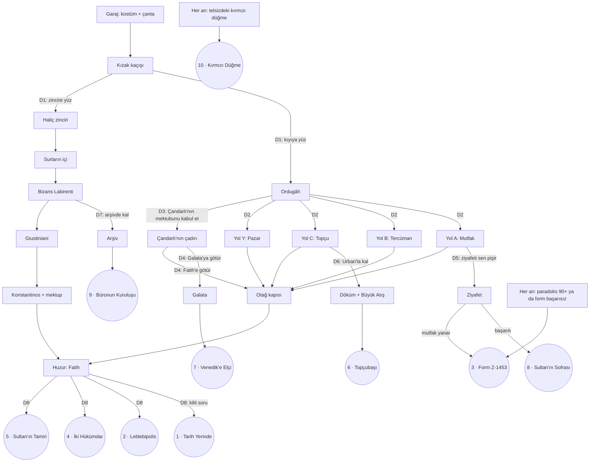

# Hikaye Dalları ve 10 Son — v0.1

> **v1.0 notu:** Oyun artık Detroit tarzı bölüm yapısına geçti: **[CHAPTERS.md](CHAPTERS.md)**. Bu belgedeki 10 son, o yapıda şöyle kullanılır:
> - Sonlar 1–9, Tolga'nın 1453'teki **Dünya sonuçlarıdır** (W1–W9). Finali tek başlarına belirlemezler; Tolga, Hikmet ve Nihat'ın kaderleriyle birleşirler.
> - Son 10 (Kırmızı Düğme), Bölüm 1–2'de erken sondur.
> - Dal noktaları D3–D7, CHAPTERS.md'deki **Bölüm 8 (Teklifler)** ve **Bölüm 9 (Dal bölümü)** olarak oynanır.

> Bu belge, **hikayenin yönünü değiştiren** kararları ve bu kararların götürdüğü **10 sonu** tanımlar.
> Tepkilerin ayrıntıları için: [ITEM_REACTIONS.md](ITEM_REACTIONS.md). Genel tasarım için: [GDD.md](GDD.md).
>
> **Değişmez kural (GDD §10):** Tolga'nın kendi hayatı hiçbir sonda değişmez. Her son, Tolga'nın pazartesi sabahı aynı servise binmesiyle biter. Dünya değişir ve bunu kimse, Tolga da, fark etmez.

## İçindekiler
1. [Hikaye haritası](#1-hikaye-haritası)
2. [Matris 1 — Dal noktaları](#2-matris-1--dal-noktaları)
3. [10 son](#3-10-son)
4. [Matris 2 — Son koşulları](#4-matris-2--son-koşulları)
5. [Matris 3 — Yol × son](#5-matris-3--yol--son)
6. [Matris 4 — Eşya × son](#6-matris-4--eşya--son)
7. [Matris 5 — Öncelik ve çakışmalar](#7-matris-5--öncelik-ve-çakışmalar)
8. [Matris 6 — 2026'da kimsenin fark etmediği değişiklikler](#8-matris-6--2026da-kimsenin-fark-etmediği-değişiklikler)
9. [Test senaryoları](#9-test-senaryoları)
10. [Kapsam](#10-kapsam)

---

## 1. Hikaye haritası

**Okuma kılavuzu:** Köşeli kutular sahnelerdir, yuvarlaklar sonlardır. `D1`–`D8` dal noktalarıdır (Matris 1). Sonlar 6, 7, 8 ve 9, oyuncuyu Fatih'in huzuruna **hiç götürmeden** bitirir: hikayenin yönü tamamen değişir.

---

## 2. Matris 1 — Dal noktaları

Hikayenin yönünü değiştiren kararlar. "Yön" sütunu, seçimin oyuncuyu hangi sahneye götürdüğünü gösterir.

| Dal | Nerede | Kim sunuyor | Seçenek | Yön | Açabileceği sonlar |
|-----|--------|-------------|---------|-----|-------------------|
| **D0** | Her an | Hikmet'in telsizi | Kırmızı düğmeye bas (3 sn basılı tut) | Anında garaja dönüş | 10 |
| **D1** | Kızak sonu, Haliç | — | Kıyıya yüz | Ordugâh | 1, 2, 3, 5, 6, 7, 8, 10 |
| | | | Zincire yüz | Bizans | 1, 3, 4, 5, 9, 10 |
| **D2** | Ordugâh | Kadri / Lütfi / Urban / pazar | A / B / C / Y yolu | Huzura geliş biçimi | A: 8 · C: 6 · hepsi: 1, 2, 3, 5 |
| **D3** | Ordugâh, pazar arkası | Çandarlı'nın adamı | Gizli mektubu kabul et | Çandarlı'nın çadırı | 7 (ya da D4'te huzura dönüş) |
| | | | Reddet | Ordugâhta kal | — |
| **D4** | Çandarlı'nın çadırı | Çandarlı Halil Paşa | Mektubu Galata'ya götür | Galata → Venedik gemisi | 7 |
| | | | Mektubu Fatih'e götür | Otağ kapısı (dürüstlük: Merak +1) | 1, 2, 3, 5 |
| **D5** | Yol A, mutfak | Aşçıbaşı Kadri | "Ziyafeti sen pişir"i kabul et | Ziyafet mini oyunu; Fatih mutfağa gelir | 8 (başarı) · 3 (yangın) |
| | | | Reddet, tepsiyi götür | Otağ kapısı | 1, 2, 3, 5 |
| **D6** | Yol C, top denemesi sonrası | Usta Urban | "Kal, top dökelim"i kabul et | Döküm + Büyük Atış; Fatih sahaya gelir | 6 |
| | | | Reddet | Otağ kapısı | 1, 2, 3, 5 |
| **D7** | Bizans Labirenti sonu | Logothetes Theodoros | "Arşivde kal"ı kabul et | Arşiv; Nihat ile sır perdesi | 9 |
| | | | Reddet | Giustiniani → Konstantinos | 1, 3, 4, 5 |
| **D8** | Huzur | Fatih | Kilit soru: "Bu şehir alınacak mı?" | Son sahnesi | 1, 2, 3, 4, 5 |

### Teklif replikleri (dalı açan cümleler)

| Dal | Türkçe | English |
|-----|--------|---------|
| **D0** | Hikmet (telsiz): *"O kırmızı düğmeye basma... Bastın mı? Neden bastın?!"* | Hikmet (radio): *"Don't press the red button... Did you press it? Why did you press it?!"* |
| **D3** | Çandarlı'nın adamı: *"Frenk elçisi! Paşam seninle görüşmek istiyor. Kimseye söyleme. Özellikle de söyleme."* | Çandarlı's man: *"Frankish envoy! My master wishes to see you. Tell no one. Especially don't tell anyone."* |
| **D4** | Çandarlı: *"Bu mektubu Galata'daki dostlarımıza götür. Savaş herkese pahalıya patlar. Barış ise sadece bana."* | Çandarlı: *"Take this letter to our friends in Galata. War is costly for everyone. Peace is costly only for me."* |
| **D5** | Kadri: *"Tepsiyi bırak evlât. Bu akşam Sultan'ın ziyafetini sen pişireceksin. Ben de yanında... denetleyeceğim."* | Kadri: *"Put the tray down, son. Tonight you cook the Sultan's feast. I'll be right beside you... supervising."* |
| **D6** | Urban: *"Çırak, kal. Seninle dünyanın en büyük topunu dökeriz. Adını da sen koyarsın. Küp dışında bir şey."* | Urban: *"Stay, apprentice. Together we'll cast the biggest cannon in the world. You can name it. Anything but 'Cube'."* |
| **D7** | Theodoros: *[Yunanca] "Yedi mühür, sıfır hata. Bu arşive sizin gibi bir memur lazım."* | Theodoros: *[Greek] "Seven seals, zero errors. This archive needs an official like you."* |

---

## 3. 10 son

Her sonun kartı: **dal**, **koşullar**, **yeni sahneler** (hikayenin yön değiştirdiği kısım), **son sahnesi** ve **2026**.

### Son 1 — Tarih Yerinde *(History Intact)* · gerçek son
- **Dal:** D8.
- **Koşullar:** Paradoks < 30 · kilit soruda *"Bunu size söyleyemem."*
- **Son sahnesi:** Fatih gülümser: *"Doğru cevap."* Tolga'yı hediyelerle yolcu eder.
- **2026:** Hiçbir şey değişmemiştir. Sadece dolapta, parti kostümünün yanında gerçek bir 1453 kaftanı asılıdır.

### Son 2 — Leblebipolis *(Chickpeapolis)*
- **Dal:** D8.
- **Koşullar:** `leblebi_given` (Kadri) · `book_shown_sultan` · Paradoks ≥ 60.
- **Son sahnesi:** Leblebi orduya "moral yemeği" olur, şehir adını değiştirir.
- **2026:** Servisin geçtiği bütün tabelalarda *Leblebipolis* yazar. Tolga kulaklıkla müzik dinler, bakmaz.

### Son 3 — Form Z-1453 *(Form Z-1453)* · bürokrasi sonu
- **Dal:** Her an. Paradoks 90'ı geçtiğinde ya da Denetçi'nin form mini oyununda başarısız olunduğunda. D5'te ziyafet mutfağı yakarsa da tetiklenir.
- **Son sahnesi:** Nihat, Tolga'yı "Zaman Bürosu Bekleme Salonu"na alır. Sıra numarası: 4.582.119. Salonda başka dönemlerden gelmiş başka Tolgalar oturur.
- **2026:** Ofisteki kahve makinesinin üstünde *"Form Z-1453 doldurulmadan kullanmayınız"* yazan bir etiket vardır.

### Son 4 — İki Hükümdar, Bir Danışman *(Two Rulers, One Consultant)*
- **Dal:** D1 (zincir) → D8.
- **Koşullar:** Bizans yolu · mektup teslim edildi · Paradoks ≥ 40 · kilit soruda 💼 *"Ortak kullanım modeli önerebilirim."*
- **Son sahnesi:** Tolga şehrin altı ay Osmanlı'nın, altı ay Bizans'ın olmasını önerir. Fatih: *"Hayır."* Tolga iki taraftan da kovulur, tarafsız Galata'da Cenevizlilere sigorta satar.
- **2026:** Sigorta şirketinin logosu bir tavuktur, altında *"Kuruluş: Galata, 1453"* yazar.

### Son 5 — Sultan'ın Tamiri *(The Sultan's Repair)* · gizli son
- **Dal:** D8.
- **Koşullar:** 📦 + 🧊 + 📱 Fatih'e gösterildi · 3 Merak Puanı · Paradoks < 60.
- **Son sahnesi:** Fatih, Zamanatör'ün uzaktan kumandasını 3 dakikada tamir eder ve Tolga'yı tam doğru zamana gönderir.
- **2026:** Garajdaki boş çerçevede Fatih'in makineyi elinde tutarken yapılmış bir portresi vardır. Hikmet: *"...Benden iyi tamir etmiş. Kimse duymasın."*

### Son 6 — Topçubaşı *(Master Gunner)* · yeni dal
- **Dal:** D6 (Yol C).
- **Teklifin gelmesi için:** Yol C · `cannon_taped` (📦 Urban'a verildi) · Urban'a 📱 (cin) ya da 🧊 (vatan) gösterildi.
- **Yön değişimi:** Tolga otağa **gitmez**. Topçu sahasında kalır; bu kez Fatih sahaya gelir.
- **Yeni sahneler:**
  1. **Döküm (≈2 dk):** Erimiş bronzu kalıba zamanlamayla dökme mini oyunu. Urban her hatada Macarca söylenir, Tolga her hatada "süreç iyileştirmesi" önerir.
  2. **Büyük Atış (≈2 dk):** Tolga, topun açısını telefondaki hesap makinesiyle hesaplar (her hesap %1 şarj). Fatih, Urban ve bütün topçular bekler.
- **Son sahnesi:** Top ateşlenir. Gülle surlara değil, bir yay çizerek tarafsız Galata'ya, bir Ceneviz tüccarının şarap fıçısına düşer. Diplomatik bir kriz çıkar. Fatih: *"Urban, çırağın hesap bilmiyor."* Tolga: *"Hesap makinesi %1'deydi."* Urban ve Tolga kimin suçlu olduğunu tartışırken Zamanatör Tolga'yı geri çeker.
- **Başarısız atış:** Şarj biterse Tolga açıyı "göz kararı" verir. Gülle 20 metre öteye düşer, sonuç yine aynı sondur ama Fatih'in repliği değişir: *"En azından kimse yaralanmadı. Urban'ın gururu hariç."*
- **2026:** Askerî Müze'deki bir topun etiketinde *"'Küp'. Dökümcü: Urban ve çırağı. Çırağın adı bilinmiyor, fesli olduğu rivayet edilir."* yazar. Servis müzenin önünden geçer, Tolga telefonuna bakıyordur.

### Son 7 — Venedik'e Elçi *(Envoy to Venice)* · yeni dal
- **Dal:** D3 → D4 (ordugâhın her yolundan).
- **Teklifin gelmesi için:** 🎩 fes takılı (Çandarlı onu Frenk elçisi sanmalıdır) · Paradoks < 60.
- **Yön değişimi:** Tolga ordugâhtan **ayrılır**. Otağ yerine tarafsız Galata'ya gider.
- **Yeni sahneler:**
  1. **Çandarlı'nın çadırı (≈1 dk):** Temkinli sadrazam, savaşın maliyetini anlatır. Tolga'nın plaza dili burada ilk kez gerçekten işe yarar: *"Burada bir risk yönetimi sorunu görüyorum."* Çandarlı: *"Nihayet anlayan biri."*
  2. **Galata (≈3 dk):** Cenevizlilerin tarafsız mahallesi. Herkes iki tarafa da mal satar. Tolga mektubu teslim edecek doğru kişiyi arar; herkes onu başka birine yönlendirir. Mektubun bir Venedik kaptanına gitmesi gerektiği anlaşılır.
  3. **Liman:** Mektubu kaptana verirken gemi kalkar. Tolga gemidedir.
- **Son sahnesi:** Tolga, Venedik'e giden bir kadırgada deniz tutmuş hâlde, mektubu sımsıkı tutar. Kaptan: *"Venedik'e hoş geldin. Üç ay sürer."* Hikmet (telsiz): *"Üç ay mı? Makinenin garantisi iki hafta."* Zamanatör Tolga'yı güvertenin ortasından çeker.
- **D4'te dürüstlük dönüşü:** Tolga mektubu Galata yerine Fatih'e götürürse bu son iptal olur. Huzurda Fatih mektubu okur, bir şey söylemez ve Tolga'ya bir Merak Puanı verir: *"Sadrazamımın mektubunu bana getirdin. İlginç bir sadakat."*
- **2026:** Venedik'te bir sokağın adı *"Calle del Turco col Capello Rosso"*dur (Kırmızı Şapkalı Türk Sokağı). Tolga'nın iş arkadaşı tatil fotoğrafını paylaşır. Tolga fotoğrafı görmeden beğenir.

### Son 8 — Sultan'ın Sofrası *(The Sultan's Table)* · yeni dal
- **Dal:** D5 (Yol A).
- **Teklifin gelmesi için:** Yol A · `stove_master` (🔥 Kadri'ye gösterildi) · `leblebi_given`.
- **Yön değişimi:** Tolga otağa **gitmez**. Mutfakta kalır; ziyafetin sonunda Fatih mutfağa gelir.
- **Yeni sahneler:**
  1. **Menü (≈1 dk):** Tolga modern yemekler önerir ve her biri tarihe takılır:
     - *"Menemen!"* Kadri: *"Domates ne?"* (Domates Amerika'dan gelir, 1453'te yoktur.)
     - *"Patates kızartması!"* Kadri: *"Patates ne?"* (O da Amerika'dan.)
     - *"Acılı bir şey!"* Kadri: *"Karabiber mi? Pahalıdır ama olur."* (Acı biber de yoktur.)
     - Tolga sonunda dönemin malzemeleriyle yetinmek zorunda kalır. Espri, oyuncuya fark ettirmeden gerçek tarih öğretir.
  2. **Ziyafet (≈3 dk):** Üç tabaklık bir yemek mini oyunu: pişirme süresi, ocak ısısı ve Kadri'nin "denetimi" (Kadri her şeyi tadar ve her seferinde fikir değiştirir). Leblebi gizli malzemedir.
- **Son sahnesi (başarı):** Fatih mutfağa gelir, üçüncü tabağı tadar ve bir süre konuşmaz. *"Bunu kim pişirdi?"* Kadri ile Tolga aynı anda cevap verir: *"Ben."* Fatih: *"İkiniz de kalın."* Tolga, *Matbah-ı Âmire'nin Gelecek Müşaviri* unvanını alır ve tam unvanı ezberlemeye çalışırken Zamanatör onu çeker.
- **Başarısızlık:** Ocak kontrolden çıkarsa mutfak dumana boğulur, paradoks fırlar, Denetçi belirir → **Son 3**.
- **2026:** Tolga'nın her öğlen gittiği esnaf lokantasının menüsünde *"Kadri Usulü Leblebili Pilav"* vardır. Tolga yıllardır onu yer ve adını hiç merak etmemiştir.

### Son 9 — Büronun Kuruluşu *(The Founding of the Bureau)* · yeni dal
- **Dal:** D1 (zincir) → D7.
- **Teklifin gelmesi için:** Bizans Labirenti **kusursuz** (7 mühür, hiç ceza yok) · `nihat_met` (Labirent'teki Denetçi cameo'su sonuna kadar izlendi, atlanmadı) · Labirent'te en az bir kez 💼 *"akış şeması"* seçeneği kullanıldı.
- **Yön değişimi:** Tolga İmparator'a **gitmez**, Fatih'e de gitmez. Bizans arşivinde kalır.
- **Yeni sahneler:**
  1. **Arşiv düzeni (≈2 dk):** Tolga, Theodoros'un arşivini plaza yöntemleriyle yeniden düzenler: renk kodları (🧊 varsa Rubik küpünün renkleri), numaralandırma, "süreç akışı". Theodoros duygulanır.
  2. **Sır perdesi (≈1 dk):** Nihat tekrar belirir, arşivdeki bir dosyayı görür ve donup kalır. Zaman Bürosu'nun kuruluş belgesi, **Form Z-1**, bu arşivdedir. Altındaki imza: *"T."* Nihat: *"Büromuzun kurucusu... sizsiniz."* Tolga: *"Ben mi? Ben sigortacıyım."*
- **Son sahnesi:** Tolga, Theodoros ve Nihat ilk Zaman Bürosu toplantısını yapar. Gündem maddesi 1: *"Fesli ziyaretçiler hakkında yönetmelik."* Zamanatör Tolga'yı toplantının ortasından çeker. Nihat tutanağa not düşer: *"Kurucu üye erken ayrıldı."*
- **2026:** Tolga'nın durağında bekleyen takım elbiseli bir adam ona şapkasıyla selam verir. Kartvizitinde *"Zaman Bürosu — Kuruluş: 1453, Konstantinopolis Arşivi"* yazar. Tolga selamı kendisine sanmaz.
- **Seri notu:** Bu son, Zaman Bürosu'nun kökenini açıklar ve sonraki bölümlerde Nihat'ın Tolga'ya neden sabır gösterdiğini anlamlı kılar.

### Son 10 — Kırmızı Düğme *(The Red Button)* · şaka son
- **Dal:** D0, her an.
- **Koşul:** Telsizdeki kırmızı düğmeyi 3 saniye basılı tutmak. Oyun bunu hiçbir yerde söylemez; sadece Hikmet sürekli basmamasını söyler.
- **Son sahnesi:** Tolga anında garaja döner. Hikmet'in tepkisi düğmeye nerede basıldığına göre değişir:

| Nerede basıldı | Türkçe | English |
|----------------|--------|---------|
| Garaj (makine çalışmadan) | *"Daha gitmedin ki. Nereden döndün?"* | *"You haven't even left. Where did you come back from?"* |
| Kızak kaçışı | *"O kadar mı? Makineyi bir yılda yaptım."* | *"That's it? I spent a year building that machine."* |
| Ordugâh / Surların içi | *"Tavuk kokuyorsun. Neredeydin?"* (Bizans'taysa) · *"Pazar kokuyorsun."* (ordugâhtaysa) | *"You smell of chicken. Where were you?"* · *"You smell like a market."* |
| Otağ kapısı | *"Kapıdan mı döndün? Deve sorusunu mu bilemedin?"* | *"You came back from the door? Couldn't answer the camel question?"* |
| Huzur | *"Tam Padişah'la konuşacakken mi?! Evlât!"* | *"Right when you were about to talk to the Sultan?! Son!"* |

- **Jenerik:** Çok kısa bir jenerik oynar. Sonunda: *"Gerçek tarih bu değil. Ama bu kadar kısa da değil."*
- **2026:** Hiçbir şey değişmemiştir. Ama bir sonraki oyunda telsizdeki kırmızı düğmenin üstüne koli bandı yapıştırılmıştır (meta). Tolga bandı sökebilir. Hikmet: *"Onu oraya boşuna yapıştırmadım."*

---

## 4. Matris 2 — Son koşulları

● gerekli · ○ yardımcı / sonu güçlendirir · ⚠ zorlaştırır (paradoksu yükseltir) · ✕ engeller · — ilgisiz

| Koşul | 1 | 2 | 3 | 4 | 5 | 6 | 7 | 8 | 9 | 10 |
|-------|:-:|:-:|:-:|:-:|:-:|:-:|:-:|:-:|:-:|:-:|
| **Ordugâh yolu** (D1 kıyı) | ○ | ● | — | ✕ | ○ | ● | ● | ● | ✕ | — |
| **Bizans yolu** (D1 zincir) | ○ | ✕ | — | ● | ○ | ✕ | ✕ | ✕ | ● | — |
| **Yol A** | — | ○ | — | — | — | ✕ | — | ● | — | — |
| **Yol C** | — | — | — | — | ○ | ● | — | ✕ | — | — |
| **🎩 Fes takılı** | — | — | — | — | — | — | ● | — | — | — |
| **Huzura ulaşmak** | ● | ● | — | ● | ● | ✕ | ✕ | ✕ | ✕ | — |
| **Paradoks** | < 30 | ≥ 60 | ≥ 90 | ≥ 40 | < 60 | — | < 60 | — | — | — |
| **Merak Puanı** | — | — | — | — | 3 | — | — | — | — | — |
| `leblebi_given` | — | ● | — | — | — | — | — | ● | — | — |
| `book_shown_sultan` | — | ● | ○ | — | — | — | — | — | — | — |
| `cannon_taped` | ⚠ | ○ | ○ | — | ⚠ | ● | — | — | — | — |
| `stove_master` | — | — | — | — | — | — | — | ● | — | — |
| `letter_opened` | ⚠ | — | ○ | ○ | ⚠ | — | — | — | — | — |
| `giustiniani_warned` | ✕ | — | ○ | ○ | ⚠ | — | — | — | — | — |
| `nihat_met` | — | — | — | — | — | — | — | — | ● | — |
| Labirent kusursuz | — | — | — | — | — | — | — | — | ● | — |
| Çandarlı teklifini kabul (D3) | — | — | — | — | — | — | ● | — | — | — |
| Dal teklifini kabul (D5/D6/D7) | — | — | — | — | — | D6 ● | — | D5 ● | D7 ● | — |
| Kırmızı düğme (D0) | — | — | — | — | — | — | — | — | — | ● |
| Form başarısızlığı / mutfak yangını | — | — | ● | — | — | — | — | — | — | — |

---

## 5. Matris 3 — Yol × son

✅ ulaşılabilir · ⚠️ ulaşılabilir ama zor · ❌ ulaşılamaz

| Son | 🍲 A | 🗣️ B | 💣 C | 🐐 Y | 🏛️ Bz | Not |
|-----|:---:|:---:|:---:|:---:|:---:|-----|
| **1. Tarih Yerinde** | ✅ | ✅ | ✅ | ✅ | ⚠️ | Bz'de paradoksu 30'un altında tutmak zor |
| **2. Leblebipolis** | ✅ | ✅ | ✅ | ✅ | ❌ | Kadri yalnızca ordugâhta |
| **3. Form Z-1453** | ✅ | ✅ | ✅ | ✅ | ✅ | Her yerden |
| **4. İki Hükümdar** | ❌ | ❌ | ❌ | ❌ | ✅ | Sadece Bizans |
| **5. Sultan'ın Tamiri** | ✅ | ✅ | ✅ | ✅ | ⚠️ | Bz'de paradoksu 60'ın altında tutmak zor |
| **6. Topçubaşı** | ❌ | ❌ | ✅ | ❌ | ❌ | Sadece Yol C |
| **7. Venedik'e Elçi** | ✅ | ✅ | ✅ | ✅ | ❌ | Çandarlı yalnızca ordugâhta |
| **8. Sultan'ın Sofrası** | ✅ | ❌ | ❌ | ❌ | ❌ | Sadece Yol A |
| **9. Büronun Kuruluşu** | ❌ | ❌ | ❌ | ❌ | ✅ | Sadece Bizans |
| **10. Kırmızı Düğme** | ✅ | ✅ | ✅ | ✅ | ✅ | Her yerden |
| **Toplam** | **7** | **6** | **7** | **6** | **6** | Her yolun en az 6 sonu var |

---

## 6. Matris 4 — Eşya × son

Çanta seçiminin hangi sonları açtığını gösterir. ● gerekli · ◐ ikisinden biri gerekli · ○ yardımcı

| Eşya | 1 | 2 | 3 | 4 | 5 | 6 | 7 | 8 | 9 | 10 |
|------|:-:|:-:|:-:|:-:|:-:|:-:|:-:|:-:|:-:|:-:|
| 📱 Telefon | | | ○ | | ● | ◐ | | | | |
| 🔥 Çakmak | | | | | | ○ | | ● | | |
| 📘 Tarih Kitabı | | ● | ○ | ○ | | | | | | |
| 🥜 Leblebi | | ● | | ○ | | | | ● | | |
| 🔋 Powerbank | | | | | ○ | ○ | | | ○ | |
| 📦 Koli Bandı | | ○ | ○ | | ● | ● | | | | |
| ☕ Termos Çay | ○ | | | ○ | | | ○ | ○ | ○ | |
| 🤳 Selfie Çubuğu | ○ | | | | | | | | | |
| 🍋 Kolonya | ○ | | | ○ | | | ○ | ○ | | |
| 🧊 Rubik Küpü | | | | | ● | ◐ | | | ○ | |

**Tasarım kontrolü:**
- Hiçbir eşya bir sonu tek başına kilitlemez. En çok eşya isteyen son (5) üç eşya ister.
- 1, 3, 4, 7, 9 ve 10 hiçbir eşya gerektirmez. Her çanta en az 6 sona açıktır.
- 🤳 Selfie çubuğu hiçbir sonu açmaz ama fotoğraf albümü (jenerik) için en önemli eşyadır.

---

## 7. Matris 5 — Öncelik ve çakışmalar

### Anlık sonlar (hikayeyi olduğu yerde keser)
| Öncelik | Son | Tetik |
|:-------:|-----|-------|
| 1 | **10. Kırmızı Düğme** | Düğme basılı tutuldu |
| 2 | **3. Form Z-1453** | Paradoks ≥ 90, form başarısızlığı ya da mutfak yangını |

### Dal sonları (dal kabul edildiğinde huzura gidilmez)
6, 7, 8 ve 9 birbirini dışlar: her biri farklı bir dal noktasında kabul edilir ve oyuncuyu huzurdan uzaklaştırır. Bir oyunda en fazla bir dal teklifi kabul edilebilir. Dal teklifi reddedilirse oyun ana akışa döner, teklif bir daha gelmez.

### Huzur sonları (D8'de birden fazla koşul tutarsa)
| Öncelik | Son | Neden |
|:-------:|-----|-------|
| 1 | **5. Sultan'ın Tamiri** | En zor ve en ödüllendirici son |
| 2 | **4. İki Hükümdar** | Kilit soruda 💼 cevabı açıkça seçilmiştir |
| 3 | **2. Leblebipolis** | Paradoks ve bayraklar |
| 4 | **1. Tarih Yerinde** | Varsayılan "iyi" son |
| — | *Hiçbiri tutmazsa* | Fatih Tolga'yı kibarca mutfağa gönderir, kilit soru yeniden sorulabilir |

---

## 8. Matris 6 — 2026'da kimsenin fark etmediği değişiklikler

Her son, 2026'daki aynı pazartesi sabahı sahnesiyle biter. Sahne aynıdır; sadece arka plandaki bir detay değişir. Oyuncu bunu görür, Tolga görmez.

| Son | Değişiklik nerede | Ne değişti | Tolga neden fark etmiyor |
|-----|-------------------|------------|--------------------------|
| 1 | Dolap | 1453'ten kalma gerçek bir kaftan | Kostümün yanında asılı, hep oradaymış gibi |
| 2 | Servis penceresi | Bütün tabelalarda *Leblebipolis* | Kulaklıkla müzik dinliyor |
| 3 | Ofis mutfağı | Kahve makinesinde *Form Z-1453* etiketi | Kahveyi zaten hep kuyrukta bekleyerek alıyor |
| 4 | Ofis girişi | Şirket logosu tavuk, *Kuruluş: Galata, 1453* | Logoya hiç bakmamış |
| 5 | Garaj | Çerçevede Fatih'in Zamanatör'lü portresi | Garaja uğramadan servise koşuyor |
| 6 | Servis güzergâhı | Askerî Müze'de "Küp" topu ve etiketi | Telefonuna bakıyor |
| 7 | Telefon | İş arkadaşının Venedik fotoğrafında *Calle del Turco col Capello Rosso* | Fotoğrafı görmeden beğeniyor |
| 8 | Öğle yemeği | Menüde *Kadri Usulü Leblebili Pilav* | Yıllardır yiyor, adını hiç okumamış |
| 9 | Durak | Takım elbiseli bir adam şapkasıyla selam veriyor | Selamı kendisine sanmıyor |
| 10 | — | Hiçbir şey (sonraki oyunda düğmede koli bandı) | Değişen bir şey yok |

---

## 9. Test senaryoları

Her son için en kısa yol. Çanta sütunundaki eşyalar önerilir; ● ile gerekli olanlar Matris 4'tedir.

| Son | Çanta | Yol | Kritik kararlar | Tahmini süre |
|-----|-------|-----|-----------------|:------------:|
| 1 | 🥜 ☕ 🤳 🍋 🔋 | 🍲 A | Hiçbir şey verme; D5'i reddet; kilit soruda "Bunu size söyleyemem" | 16 dk |
| 2 | 🥜 📘 📱 📦 🔥 | 🗣️ B | 🥜 Kadri'ye ver, 📦 Urban'a ver, 📱 Urban'a göster, 📘 Fatih'e göster, kilit soruda "Evet, alacaksınız" (paradoks ≥ 60) | 18 dk |
| 3 | 📘 📦 📱 🔥 🔋 | 💣 C | Her şeyi anlat, D6'yı reddet, kilit soruda "Hayır" | 15 dk |
| 4 | 🥜 🍋 📘 📱 ☕ | 🏛️ Bz | D7'yi reddet, 🥜 Konstantinos'a, 🍋 Giustiniani'ye, mektubu aç, kilit soruda 💼 | 22 dk |
| 5 | 📦 🧊 📱 🥜 🤳 | 🗣️ B | 📦 🧊 📱 Fatih'e göster, 3 Merak, paradoks < 60 | 18 dk |
| 6 | 📦 📱 🧊 🔥 🔋 | 💣 C | 📦 Urban'a ver, 📱 göster, D6'yı kabul et | 17 dk |
| 7 | 🍋 ☕ 🥜 🤳 🔋 | 🗣️ B | Fes takılı kal, D3'ü kabul et, D4'te Galata | 15 dk |
| 8 | 🔥 🥜 ☕ 🍋 🤳 | 🍲 A | 🔥 ve 🥜 Kadri'ye, D5'i kabul et, ziyafeti başar | 19 dk |
| 9 | ☕ 🧊 🔋 🍋 📱 | 🏛️ Bz | Labirent'i kusursuz bitir, 💼 akış şeması, D7'yi kabul et | 16 dk |
| 10 | Herhangi | Herhangi | Telsizdeki kırmızı düğmeyi 3 sn basılı tut | 1–20 dk |

---

## 10. Kapsam

Yeni dallar demonun süresini tek bir oyunda uzatmaz: her oyun tek bir yol izler. Ama yapılacak içerik artar.

| Son | Yeni sahne | Yeni mini oyun | Tahmini iş | Aşama |
|-----|------------|----------------|:----------:|-------|
| 1, 2, 3, 5 | — | — | Huzur sahnesiyle birlikte | M4 |
| 10 | — | — | Çok küçük | M4 |
| 4 | Bizans yolu | Zincir, Labirent | Bizans yoluyla birlikte | M5 |
| 9 | Arşiv, Büro toplantısı | Arşiv düzeni | Küçük (Labirent haritasını kullanır) | M5 |
| 6 | Döküm alanı, Büyük Atış | Döküm, açı hesabı | Orta | M6 |
| 8 | Ziyafet mutfağı | Üç tabak yemek | Orta | M6 |
| 7 | Çandarlı'nın çadırı, Galata, liman | — (diyalog ve keşif) | Orta (yeni harita) | M6 |

**Zaman yetmezse:** 7 (Galata yeni bir harita ister) ertelenebilir. Demo 9 sonla da çıkabilir; D3 teklifi o durumda "Paşam şu an meşgul" repliğiyle kapanır.
